### A Full-Stack E-commerce (Buy or Sell Products) with Flask, MySQL, React JS, and MPESA Payment Integration
<b>Introduction</b> <br/>
In this Module, You will be creating a Complete Full-Stack commerce Web Application(Selling and Buying System)  built with Flask for the backend, MySQL for the database, and React JS for the frontend.
We will Call This Application <h3><b>SOKOGARDEN</b></h3>
<br>
This E-Commerce Web Application is a website where people can buy and sell products online, The application is inspired by growing web applications such Jumia, Kilimall, Alibaba, and Jiji. It Allows users to create account(Signup), Sign in Sell Products, Buy Products, Browse Products, Make MPESA Payment etc.
<br><br>
DEMO the Web Application<br>
Link : https://sokogarden.vercel.app  <br>

The Flask backend serves as the Backend layer, providing several key functions:

2. Backend (Flask)

    User Authentication: The backend handles user registration and login, storing users’ details (like emails and passwords) in the MySQL database.
     
    Product Management: The application retrieves product details from the MySQL database, including product_name, description , cost, photo etc and send it to the frontend for buyers to see the details. It also handles user signup, signin, product addition, product search and view, and payment processing.

    MPESA Payment: When users are ready to pay, the backend interacts with the MPESA API to initiate and confirm mobile payments.

3. Database (MySQL)

The database stores the essential information for the application:

Users Table: Contains user details (name, email, password).
Product Table: Stores products details like name, description, price, and photo.
<br>

4. MPESA Payment Integration

    Payment Initiation: After selecting products, the user is asked to pay via MPESA. The backend sends a request to MPESA API with payment details.

<br>
<b>Technologies Used</b>
Frontend: React JS for building the user interface and interacting with the Flask API.
Backend: Flask for handling user authentication, managing producrs, and processing MPESA payments.
Database: MySQL for storing user and doctors information.
Payment: MPESA API for handling mobile money payments.

### THIS REPO CREATES THE BACKEND ONLY
## Step 1: Creating MySQL Database.
To build a shopping system with Flask and MySQL, the first step is to create a MySQL database. The database will store important data such as user information (names, emails, passwords) and product details (names, descriptions, prices, quantities).
<br/>
Please check our Book4 for SQL Database Setup and Guide.

<br/>
<b><h3>NB: Use your Existing Database</h3></b>
<br/>

In Your Database Create below two tables; <br/>
1. users  -  used to store our system users<br/>
2. product_details - used to store product details/information 
<br/>


<b>Users Table</b>

        CREATE TABLE users (
            user_id INT AUTO_INCREMENT PRIMARY KEY,
            username VARCHAR(50) NOT NULL,
            password VARCHAR(50) NOT NULL,
            email VARCHAR(50) NOT NULL,
            phone VARCHAR(50)
        );


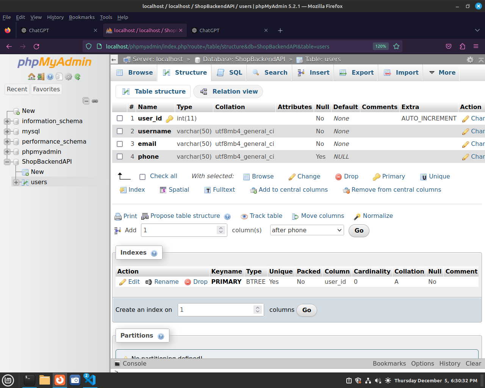        


<b>Products Table</b>
       
       CREATE TABLE product_details (
            product_id INT AUTO_INCREMENT PRIMARY KEY,
            product_name VARCHAR(255) NOT NULL,
            product_description TEXT,
            product_cost INT,
            product_photo VARCHAR(255)
        );


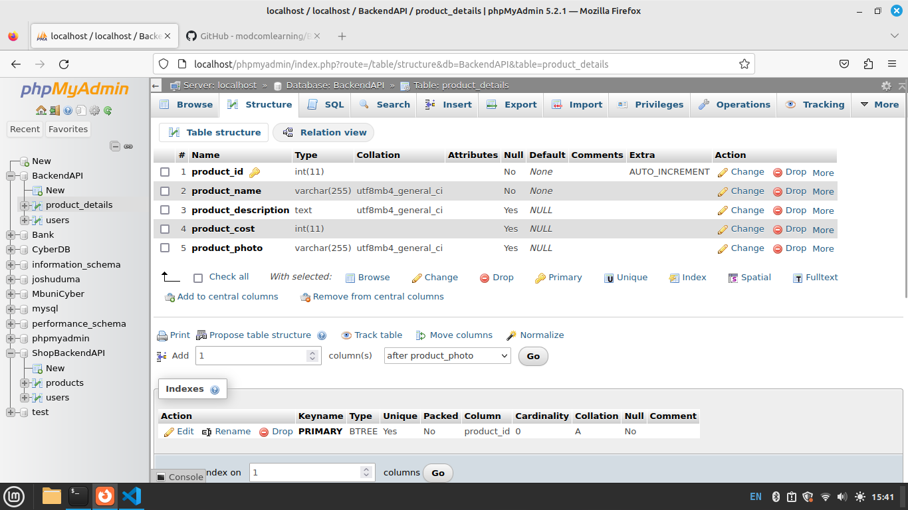

<br/>
Now that we have a Database with Tables, Next step is to create a Python Application to interact with this Database.
<br/>

## Step 1-1: Flask Framework

Flask is a popular web framework for building web applications in Python. It's designed to be simple, lightweight, and flexible, making it a great choice for developers who are learning web development. Here's an introduction to Flask.

<b>Key Features of Flask: </b>

<b>Easy to Use:</b> Flask is friendly due to its design and minimal setup. You can start building a web application with just a few lines of code. Flask is a good choice for backend development when creating advanced applications.

<b>Python-Based:</b> Since Flask is a Python framework, if you are familiar with Python, you will find it relatively easy to get started. Flask allows you to focus on building the logic and features of your app rather than dealing with complex configurations.

<b>Routing:</b> One of the most important features of Flask is routing, which allows you to map specific URLs to Python functions. For example, you can define a route for your homepage (/), and when someone visits your website, Flask will call the corresponding function to show the page.

<b>Development Server:</b> Flask comes with a built-in development server that makes testing and debugging applications easier. It automatically reloads when you make changes to the code.

<b>Extensible:</b> Flask can be extended with many plugins to handle more complex tasks, such as database integration (using SQLAlchemy), form validation, authentication, and more.

<b>Security: </b> It provides many tools and best practices that you can use to build secure web applications.

<b>Popularity: </b> Flask is extremely popular and in high demand, largely due to its use of Python, one of the most widely used and loved programming languages in the world. Here’s why Flask’s popularity is growing, and why it's in demand:


<b>Conclusion</b>:
Flask is popular and in demand primarily due to its use of Python, one of the most loved and versatile programming languages. Its simplicity, flexibility, and ability to integrate well with modern tools have made it a go-to framework for developers building everything from simple web apps to advanced systems. Whether you're building APIs, microservices, or integrating machine learning models, Flask's growing popularity and demand in the tech industry make it an excellent choice for backend development.


## Step 2: API Creation Development using Flask
What is an API?

API stands for Application Programming Interface. It allows different software applications to communicate with each other. APIs define the functions to exchange information between back end and front end. <br>

API stands for Application Programming Interface:  <br>

<b>A (Application)</b> – A software program or system that performs specific tasks.<br>
<b>P (Programming) </b> – The process of writing code to create program .<br>
<b>I (Interface) </b> – A point of interaction that allows different applications to communicate with each other.<br>

<b>In the context of web development:</b> <br>
An API allows a frontend (like a website or mobile app) to interact with a backend server.
The backend exposes various links or endpoints that the frontend can send requests to (like fetching product data, registering a user, or processing payments).

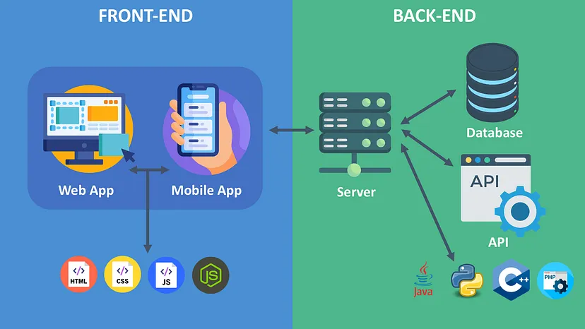
<br>
In this Module we do the Backend using Python and SQL<br>
For example, our E-commerce Web Application will have an API to handle user registration, login, add  product and retrieving Products listings etc.  Lets Do it Practically!
<br/>


## Step 2.1: Setting Up Flask, Testing Routes
Install Flask module if you haven't installed already:
   
     pip install flask

Create a New Folder(Create a Class Folder for this Project), inside this folder, create a Python File named test.py. <br/>
In this File we first learn the fundamentals on how create and interact with API (Application Programming Interface). Then we will move to Step 3: Where we create our eCommerce API.

in test.py add this code
    
```python
from flask import *

# Create the Flask appl
app = Flask(__name__)
# Define a simple route/Endpoint
@app.route('/api/home')
def home():
    return jsonify({"message":"Welcome to HOME API!"})

# Run the app if this file is executed directly
if __name__ == '__main__':
    app.run(debug=True)
```

<b>Explanation</b> <br/>
This code creates a basic Flask web application.<br/>

1. app = Flask(__name__): Initializes the Flask app.<br/>
2. @app.route('/api/home'): Defines a route for the /signup URL.<br/>
3. def home(): The function that returns the message "Welcome to sign Up API!" when the /api/home route is accessed. Each must be attached to a function to give a fuctionality<br/> The message returned uses jsonify to return response in form of a Key Value Pair (Dictionary)
4. if __name__ == '__main__': Ensures the app runs only when the script is executed directly, not when imported as a module.<br/>
5. app.run(debug=True): Starts the development server with debugging enabled.<br/><br/>

Test this code in Insomnia -  Insomnia is a popular, open-source API client used for testing, debugging, and interacting with APIs.
<br/>
The API running at http://127.0.0.1:5000/   <br/>
For us to access the Home Route we write it in this format http://127.0.0.1:5000/api/home <br>

Use http://127.0.0.1:5000/api/home  while Testing your API in insomnia, http://127.0.0.1:5000/api/home  is also known an endpoint since its the link we use to reach the API <br/>

NB: Ininsomnia we use GET  -  GET only retrieves data from a server.
<br>
There are two types of messages: requests sent by the client to trigger an action on the server, and responses, the answer that the server sends in response to a request.

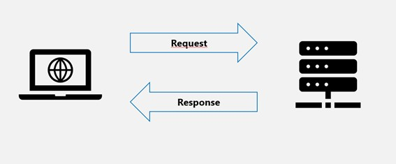

<br>
Output

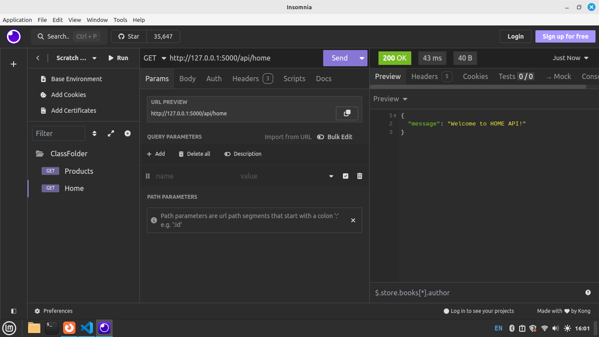


In test.py add another endpoint  

    from flask import *

    # Create the Flask appl
    app = Flask(__name__)
    # Define a simple route/Endpoint
    @app.route('/api/home')
    def home():
        return jsonify({"message":"Welcome to HOME API!"})


    # Define a another simple route/Endpoint
    @app.route('/api/products')
    def products():
        return jsonify({"message":"Welcome to PRODUCTS API!"})


    # Run the app if this file is executed directly
    if __name__ == '__main__':
        app.run(debug=True)


Use http://127.0.0.1:5000/api/products  while Testing your API in insomnia, http://127.0.0.1:5000/api/products  is also known an endpoint since its the link we use to reach the API <br/>

Output


<b>Students Practice</b> <br>
- Create a route/endpoint named /api/services </>
- Create a function for this route and return a message "W"elcome to Our Services API.
- Test this endpoint in Insomnia. NB: Create a new request in insomnia.
<br>

## Step 2.2: Posting variables Request to API and Get Responses
In this example we are going to send a request with two numbers to our API endpoint named /api/calc , the api will process, add the two numbers and return a response with an answer.
<br>

in test.py add the /api/calc Route/endpoint as shown below.

    from flask import *

    # Create the Flask appl
    app = Flask(__name__)
    # Define a simple route/Endpoint
    @app.route('/api/home')
    def home():
        return jsonify({"message":"Welcome to HOME API!"})


    # Define a another simple route/Endpoint
    @app.route('/api/products')
    def products():
        return jsonify({"message":"Welcome to PRODUCTS API!"})

    # Define a another simple route/Endpoint
    @app.route('/api/calc', methods = ['POST'])
    def calc():
        if request.method == 'POST':
            number1 = request.form['number1']
            number2 = request.form['number2']
            sum = int(number1)  + int(number2)
            # Return a dictionary : Key - Value Pairs
            return jsonify({'Answer ': sum})
        

    # Run the app if this file is executed directly
    if __name__ == '__main__':
        app.run(debug=True)

Test in Insomnia
When testing Please choose POST as the method and Form Data to send post the two variables number1 and number2, see below on how to pick form data.


See below image on how to append data to the request, we append number1 and number2 with their respective values. 

The API endpoint we are using to access our calc is http://127.0.0.1:5000/api/calc

Output


## Step 3: Setting Up Flask App for Our eCommerce Web Application

Create a New Folder(Create a Class Folder for this Project), inside this folder, create a Python File named app.py. <br/>
In this File we create our API (Application Programming Interface)
<br/>
Inside app.py write below code.

        from flask import *

        # Create the Flask application instance
        app = Flask(__name__)

        # Define a simple route/Endpoint
        @app.route('/api/signup')
        def signup():
            return "Welcome to sign Up API!"

        # Run the app if this file is executed directly
        if __name__ == '__main__':
            app.run(debug=True)

<br/><br/>
<b>Explanation</b> <br/>
This code creates a basic Flask web application.<br/>

1. app = Flask(__name__): Initializes the Flask app.<br/>
2. @app.route('/signup'): Defines a route for the /signup URL.<br/>
3. def signup(): The function that returns the message "Welcome to sign Up API!" when the /signup route is accessed.<br/>
4. if __name__ == '__main__': Ensures the app runs only when the script is executed directly, not when imported as a module.<br/>
5. app.run(debug=True): Starts the development server with debugging enabled.<br/><br/>


Test this code in Insomnia -  Insomnia is a popular, open-source API client used for testing, debugging, and interacting with APIs.
<br/>
The API running at http://127.0.0.1:5000/   <br/>
For us to access the Signup Route we write it in this format http://127.0.0.1:5000/api/signup <br>

Use http://127.0.0.1:5000/api/signup  while Testing your API in insomnia <br/>

Output

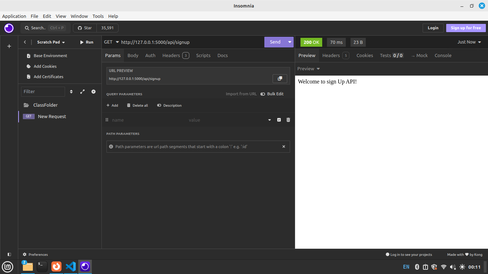

Done, we have tested our first API

<br>
<br>


## Step 4: Create a SignUp API.
When you refer to signup, it typically means the process where users register their details to create an account on a website or application. During the signup process, users provide certain information (e.g., username, email, password) that is stored in the system to uniquely identify them and allow them to access features of the application.

First install pymysql

    pip install pymysql

Then import pymysql like below.

    import pymysql

An endpoint in web development and APIs is a specific URL that allows you to access or interact with the API.
i.e http://127.0.0.1:5000/api/signup    is an endpoint


Update your /api/signup route as follows.
Below is the updated app.py

        from flask import *
        # Create the Flask application instance
        app = Flask(__name__)
        import pymysql

        # Define the sign up Endpoint
        @app.route('/api/signup', methods = ['POST'])
        def signup():
            if request.method =='POST':
                username = request.form['username']
                email = request.form['email']
                password = request.form['password']
                phone = request.form['phone']
            
                # COnnect to DB
                connection = pymysql.connect(host='localhost', user='root',
                                                password='',database='BackendAPI')
                # Do insert query
                cursor = connection.cursor()
                cursor.execute('insert into users(username,email,password, phone)values(%s,%s,%s,%s)',
                                    (username, email, password, phone))
                
                # we need to make a commit to changes to dbase
                connection.commit()
                return jsonify({"success": "Thank you for Joining"})


        # Run the app if this file is executed directly
        if __name__ == '__main__':
            app.run(debug=True)


RUn your flask app, The above api can be accessed through  http://127.0.0.1:5000/api/signup   <br>

<b>Explanation </b> <br/>
This code defines a sign-up endpoint (/api/signup) for handling POST requests.<br/>

1. Request handling: It extracts the username, email, password, and phone from the form data submitted in the POST request.<br/>
2. Database connection: It connects to a MySQL database (BackendAPI) using pymysql and creates a cursor to execute the SQL query that inserts user data into the users table.<br/>
3. Commit changes: The transaction is committed to save the data in the database.<br/>
4. Response: It returns a JSON(Key-Value Pairs-Dictionary)response with a success message: "Thank you for Joining".<br/><br/>


Test above api in Insomnia.
NB: In insomnia create a New Folder to store requests (Also rename your requests).
In below requests we use http://127.0.0.1:5000/api/signup as the endpoint, we use POST and the body is exactly as they are defined in our /api/signup Endpoint request variables.


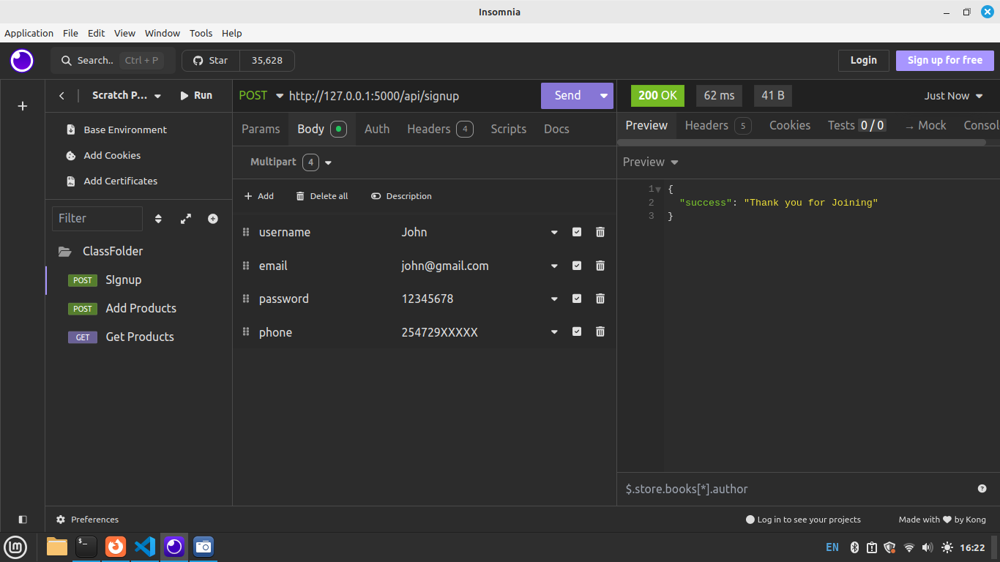


## Step 5: Create a Signin API.
Below API endpoint will allow users to Signin using credentials provided in /api/signup in Step 4 above. Update your app.py by adding an /api/signin route as shown below.

# Define the sign in Endpoint
    import pymysql.cursors
    @app.route('/api/signin', methods = ['POST'])
    def signin():
        if request.method == 'POST':
            # Extract POST data
            email = request.form['email']
            password = request.form['password']
            
            # Connect to DB
            connection = pymysql.connect(host='localhost', user='root',
                                            password='',database='BackendAPI')
            
            # Create a cursor to return results a dictionary
            cursor = connection.cursor(pymysql.cursors.DictCursor)
            sql = "select * from users where email = %s and password = %s"
            data = (email, password)
            cursor.execute(sql,data)
            
            #  Check how many rows are found
            count = cursor.rowcount
            # If rows a zero, Invalid Credentials - No user Found
            if count == 0:
                return jsonify({"message": "Login Failed"})
            else:
                # else there is a user, return a message to say login success and all user details
                user = cursor.fetchone()
                
                # Return login success message with user details as a dictionary
                return jsonify({"message": "Login Success", "user": user})


NB: Above we imported import pymysql.cursors  and used in the cursor cursor = connection.cursor(pymysql.cursors.DictCursor), this will help in returning the user details in a Key Value representation or a Dictionary

Your complete app.py now looks like below.

        from flask import *

        # Create the Flask application instance
        app = Flask(__name__)
        import pymysql

        # Define the sign up Endpoint
        @app.route('/api/signup', methods = ['POST'])
        def signup():
            if request.method =='POST':
                username = request.form['username']
                email = request.form['email']
                password = request.form['password']
            
                # COnnect to DB
                connection = pymysql.connect(host='localhost', user='root',
                                                password='',database='BackendAPI')
                # Do insert query
                cursor = connection.cursor()
                cursor.execute('insert into users(username,email,password)values(%s,%s,%s)',
                                    (username, email, password))
                
                # we need to make a commit to changes to dbase
                connection.commit()
                return jsonify({"success": "Thank you for Joining"})

        # Define the sign in Endpoint
        import pymysql.cursors
        @app.route('/api/signin', methods = ['POST'])
        def signin():
            if request.method == 'POST':
                email = request.form['email']
                password = request.form['password']  
                
                # Connect to DB
                connection = pymysql.connect(host='localhost', user='root',
                                                password='',database='BackendAPI')
                
                cursor = connection.cursor(pymysql.cursors.DictCursor)
                sql = "select * from users where email = %s and password = %s"
                data = (email, password)
                cursor.execute(sql,data)
                
                #  Check how many rows are found
                count = cursor.rowcount
                # If rows a zero, Invalid Credentials
                if count == 0:
                    return jsonify({"message": "Login Failed"})
                else:
                    # else there is a user, return a message to say login success and all user details
                    user = cursor.fetchone()
                    
                    # Return login success message with user details as a tuple
                    return jsonify({"message": "Login success", "user": user})
                


        # Run the app if this file is executed directly
        if __name__ == '__main__':
            app.run(debug=True)


Test Signin insomnia.<br/> use http://127.0.0.1:5000/api/signin  as Endpoint <br>
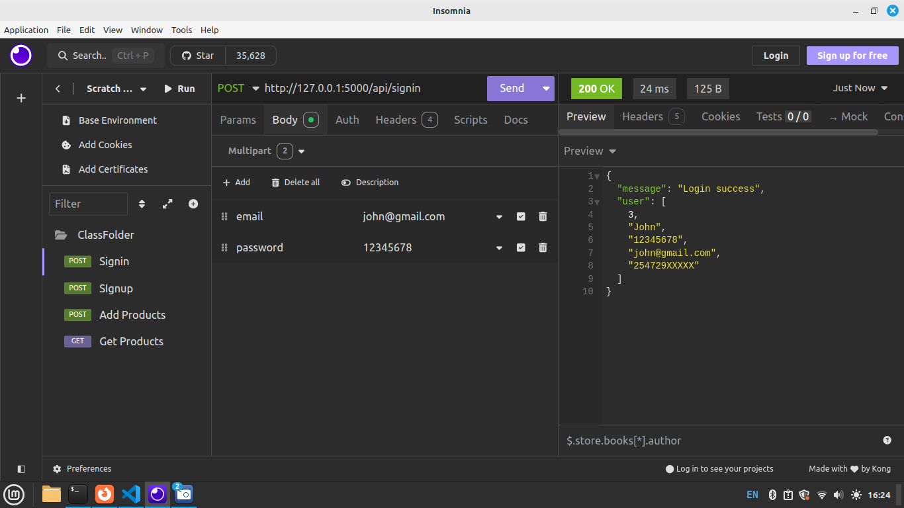


## Step 6: Create a Product upload API.
This endpoint will be used by users in uploading their products details
First create Folder named static in your Flask folder.
Inside static create a subfolder named images. (This is where the products photos will be uploaded)

In app.py add below lines to set up Upload directory where our products image will be uploaded <br>
You can place then Just below <b>app = Flask(__name__) </b>

    # setup file upload
    import os
    app.config['UPLOAD_FOLDER'] = 'static/images'


In app.py add below route to create the API Endpoint

    # Define the Add Product Route/Endpoint
    @app.route('/api/add_product', methods=['POST'])
    def add_product():
        if request.method == 'POST':
            # Extract POST Data
            product_name = request.form['product_name']
            product_description = request.form['product_description']
            product_cost = request.form['product_cost']
            # Extract image data
            photo = request.files['product_photo']
            # Get the image file name
            filename = photo.filename
            # SPecify where the image will be saved (in static Folder) - Image Path
            photo_path = os.path.join(app.config['UPLOAD_FOLDER'], filename)
            # Save your image
            photo.save(photo_path)

            # Connect to DB
            connection = pymysql.connect(host='localhost', user='root',
                                            password='',database='BackendAPI')
            # Prepare and execute the insert query
            cursor = connection.cursor()
            cursor.execute('INSERT INTO product_details (product_name, product_description, product_cost, product_photo) '
                        'VALUES (%s, %s, %s, %s)',
                        (product_name, product_description, product_cost,  filename))

            # Commit the changes to the database
            connection.commit()
            # Return success message in Dictionary Format
            return jsonify({"success": "Product details added successfully"})


Test above in insomnia

NB: product_photo must be provided as a File since its an Image.

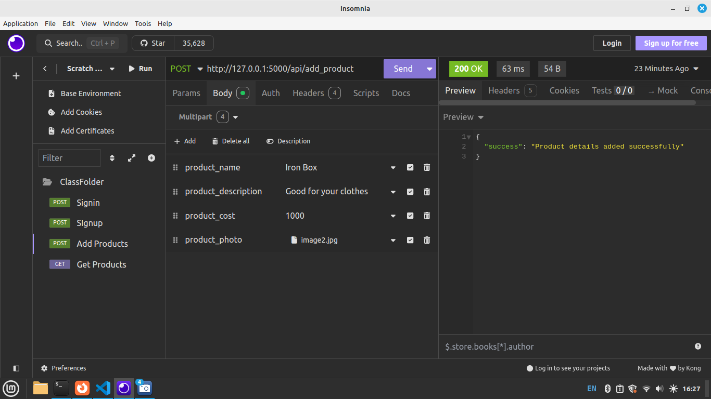

## Step 7: Create a Get Products  API.
This endpoint will be used by users to View Posted products
In app.py add below route to create the API Endpoint.

    # Define the Get Product Details Route/Endpoint
    import pymysql.cursors
    @app.route('/api/get_product_details', methods=['GET'])
    def get_product_details():

        # Connect to the database with DictCursor for direct dictionary results
        connection = pymysql.connect(host='localhost', user='root',
                                            password='',database='BackendAPI')

        # Create a cursor object and fetch all products details from the products_details table
        cursor = connection.cursor(pymysql.cursors.DictCursor)
        cursor.execute('SELECT * FROM product_details')
        product_details = cursor.fetchall()

        # Close the database connection
        connection.close()

        # Return the products details directly as a dictionay - JSON
        return jsonify(product_details)


Test in Insmnia
In below image shows a Dictionary - JSON Array showing several products displayed
Output
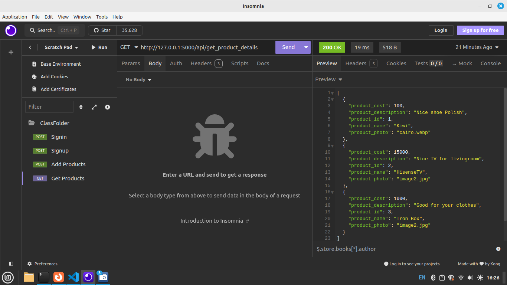


## Step 8: Making an MPESA Payment API.
The API Endpoint below will be used for any payment to be done in our E-commerce Web Application.
We will use MPESA Daraja Intergration. Please check https://developer.safaricom.co.ke/


NB: you will need to install requests if not already installed.

    pip install requests

In app.py add below code

    # Mpesa Payment Route 
    import requests
    import datetime
    import base64
    from requests.auth import HTTPBasicAuth

    @app.route('/api/mpesa_payment', methods=['POST'])
    def mpesa_payment():
        if request.method == 'POST':
            amount = request.form['amount']
            phone = request.form['phone']
            # GENERATING THE ACCESS TOKEN
            # create an account on safaricom daraja
            consumer_key = "GTWADFxIpUfDoNikNGqq1C3023evM6UH"
            consumer_secret = "amFbAoUByPV2rM5A"

            api_URL = "https://sandbox.safaricom.co.ke/oauth/v1/generate?grant_type=client_credentials"  # AUTH URL
            r = requests.get(api_URL, auth=HTTPBasicAuth(consumer_key, consumer_secret))

            data = r.json()
            access_token = "Bearer" + ' ' + data['access_token']

            #  GETTING THE PASSWORD
            timestamp = datetime.datetime.today().strftime('%Y%m%d%H%M%S')
            passkey = 'bfb279f9aa9bdbcf158e97dd71a467cd2e0c893059b10f78e6b72ada1ed2c919'
            business_short_code = "174379"
            data = business_short_code + passkey + timestamp
            encoded = base64.b64encode(data.encode())
            password = encoded.decode('utf-8')

            # BODY OR PAYLOAD
            payload = {
                "BusinessShortCode": "174379",
                "Password": "{}".format(password),
                "Timestamp": "{}".format(timestamp),
                "TransactionType": "CustomerPayBillOnline",
                "Amount": "1",  # use 1 when testing
                "PartyA": phone,  # change to your number
                "PartyB": "174379",
                "PhoneNumber": phone,
                "CallBackURL": "https://modcom.co.ke/api/confirmation.php",
                "AccountReference": "account",
                "TransactionDesc": "account"
            }

            # POPULAING THE HTTP HEADER
            headers = {
                "Authorization": access_token,
                "Content-Type": "application/json"
            }

            url = "https://sandbox.safaricom.co.ke/mpesa/stkpush/v1/processrequest"  # C2B URL

            response = requests.post(url, json=payload, headers=headers)
            print(response.text)
            return jsonify({"message": "Please Complete Payment in Your Phone and we will deliver in minutes"})


Test in Insomnia <br/>

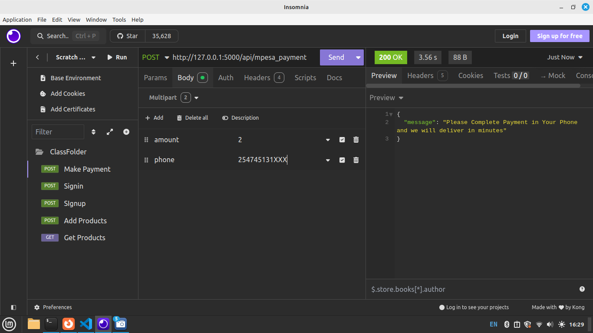
<br>
Your Final app.py looks like below
    
    # THIS IS AN API FOR Ecommerce Backend
    from flask import *

    # Create the Flask application instance
    app = Flask(__name__)

    # setup file upload
    import os
    app.config['UPLOAD_FOLDER'] = 'static/images'
    import pymysql


    # Define the sign up Route/Endpoint
    @app.route('/api/signup', methods = ['POST'])
    def signup():
        if request.method =='POST':
            username = request.form['username']
            email = request.form['email']
            password = request.form['password']
            phone = request.form['phone']
        
            # COnnect to DB
            connection = pymysql.connect(host='localhost', user='root',
                                            password='',database='BackendAPI')
            # Do insert query
            cursor = connection.cursor()
            cursor.execute('insert into users(username,email,password, phone)values(%s,%s,%s,%s)',
                                (username, email, password, phone))
            
            # we need to make a commit to changes to dbase
            connection.commit()
            return jsonify({"success": "Thank you for Joining"})


    # Define the sign in Route/Endpoint
    @app.route('/api/signin', methods = ['POST'])
    def signin():
        if request.method == 'POST':
            # Extract POST Data
            email = request.form['email']
            password = request.form['password']
        
            
            # Connect to DB
            connection = pymysql.connect(host='localhost', user='root',
                                            password='',database='BackendAPI')
            
            # Create a Cursor
            cursor = connection.cursor()
            sql = "select * from users where email = %s and password = %s"
            data = (email, password)
            cursor.execute(sql,data)
            
            #  Check how many rows are found
            count = cursor.rowcount
            # If rows a zero, Invalid Credentials
            if count == 0:
                return jsonify({"message": "Login Failed"})
            else:
                # else there is a user, return a message to say login success and all user details
                user = cursor.fetchone()
                
                # Return login success message with user details as a tuple
                return jsonify({"message": "Login success", "user": user})
            


    # Define the Add Product Route/Endpoint
    @app.route('/api/add_product', methods=['POST'])
    def add_product():
        if request.method == 'POST':
            # Extract POST Data
            product_name = request.form['product_name']
            product_description = request.form['product_description']
            product_cost = request.form['product_cost']
            # Extract image data
            photo = request.files['product_photo']
            # Get the image file name
            filename = photo.filename
            # SPecify where the image will be saved (in static Folder) - Image Path
            photo_path = os.path.join(app.config['UPLOAD_FOLDER'], filename)
            # Save your image
            photo.save(photo_path)

            # Connect to DB
            connection = pymysql.connect(host='localhost', user='root',
                                            password='',database='BackendAPI')
            # Prepare and execute the insert query
            cursor = connection.cursor()
            cursor.execute('INSERT INTO product_details (product_name, product_description, product_cost, product_photo) '
                        'VALUES (%s, %s, %s, %s)',
                        (product_name, product_description, product_cost,  filename))

            # Commit the changes to the database
            connection.commit()
            # Return success message in Dictionary Format
            return jsonify({"success": "Product details added successfully"})


    # Define the Get Product Details Route/Endpoint
    import pymysql.cursors
    @app.route('/api/get_product_details', methods=['GET'])
    def get_product_details():

        # Connect to the database with DictCursor for direct dictionary results
        connection = pymysql.connect(host='localhost', user='root',
                                            password='',database='BackendAPI')

        # Create a cursor object and fetch all products details from the products_details table
        cursor = connection.cursor(pymysql.cursors.DictCursor)
        cursor.execute('SELECT * FROM product_details')
        product_details = cursor.fetchall()

        # Close the database connection
        connection.close()

        # Return the products details directly as a dictionay - JSON
        return jsonify(product_details)


    # Mpesa Payment Route/Endpoint 
    import requests
    import datetime
    import base64
    from requests.auth import HTTPBasicAuth

    @app.route('/api/mpesa_payment', methods=['POST'])
    def mpesa_payment():
        if request.method == 'POST':
            amount = request.form['amount']
            phone = request.form['phone']
            # GENERATING THE ACCESS TOKEN
            # create an account on safaricom daraja
            consumer_key = "GTWADFxIpUfDoNikNGqq1C3023evM6UH"
            consumer_secret = "amFbAoUByPV2rM5A"

            api_URL = "https://sandbox.safaricom.co.ke/oauth/v1/generate?grant_type=client_credentials"  # AUTH URL
            r = requests.get(api_URL, auth=HTTPBasicAuth(consumer_key, consumer_secret))

            data = r.json()
            access_token = "Bearer" + ' ' + data['access_token']

            #  GETTING THE PASSWORD
            timestamp = datetime.datetime.today().strftime('%Y%m%d%H%M%S')
            passkey = 'bfb279f9aa9bdbcf158e97dd71a467cd2e0c893059b10f78e6b72ada1ed2c919'
            business_short_code = "174379"
            data = business_short_code + passkey + timestamp
            encoded = base64.b64encode(data.encode())
            password = encoded.decode('utf-8')

            # BODY OR PAYLOAD
            payload = {
                "BusinessShortCode": "174379",
                "Password": "{}".format(password),
                "Timestamp": "{}".format(timestamp),
                "TransactionType": "CustomerPayBillOnline",
                "Amount": "1",  # use 1 when testing
                "PartyA": phone,  # change to your number
                "PartyB": "174379",
                "PhoneNumber": phone,
                "CallBackURL": "https://modcom.co.ke/api/confirmation.php",
                "AccountReference": "account",
                "TransactionDesc": "account"
            }

            # POPULAING THE HTTP HEADER
            headers = {
                "Authorization": access_token,
                "Content-Type": "application/json"
            }

            url = "https://sandbox.safaricom.co.ke/mpesa/stkpush/v1/processrequest"  # C2B URL

            response = requests.post(url, json=payload, headers=headers)
            print(response.text)
            return jsonify({"message": "Please Complete Payment in Your Phone and we will deliver in minutes"})
        

    # Run the app if this file is executed directly
    if __name__ == '__main__':
        app.run(debug=True)
    


In order to allow this API be accessible by the Front End system to be created.<br>
We need to enable CORS.<br>
Read more on CORS. <br>
https://blog.postman.com/what-is-cors/ <br><br>

First install CORS in Flask. 

        pip install flask-cors

Then import CORS and Configure in your app
   
        from flask_cors import CORS
        CORS(app)

You can add above code just below  <b>app = Flask(__name__) </b>

In this Github repo, we created an <b>Backend API for E-commerce Web Application</b> <br>
The application provides an API to signup, signin, add_product, get_product_details and MPESA payment integration. This API creates the Back - End of our full-stack application.

Above API will be accessed in the Front - End (User Side) by React JS and Android Application. <br>

Next is FrontEnd Development using Javascript, React JS.  <br>
Check this link for updates on Frontend Documentation.

<h3>Happy Coding! </h3>