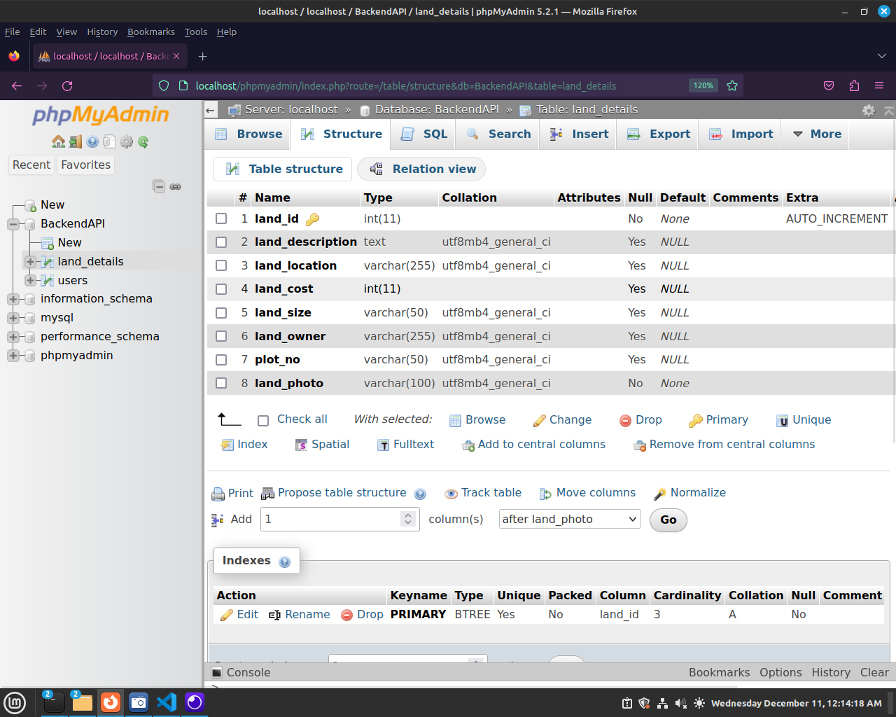
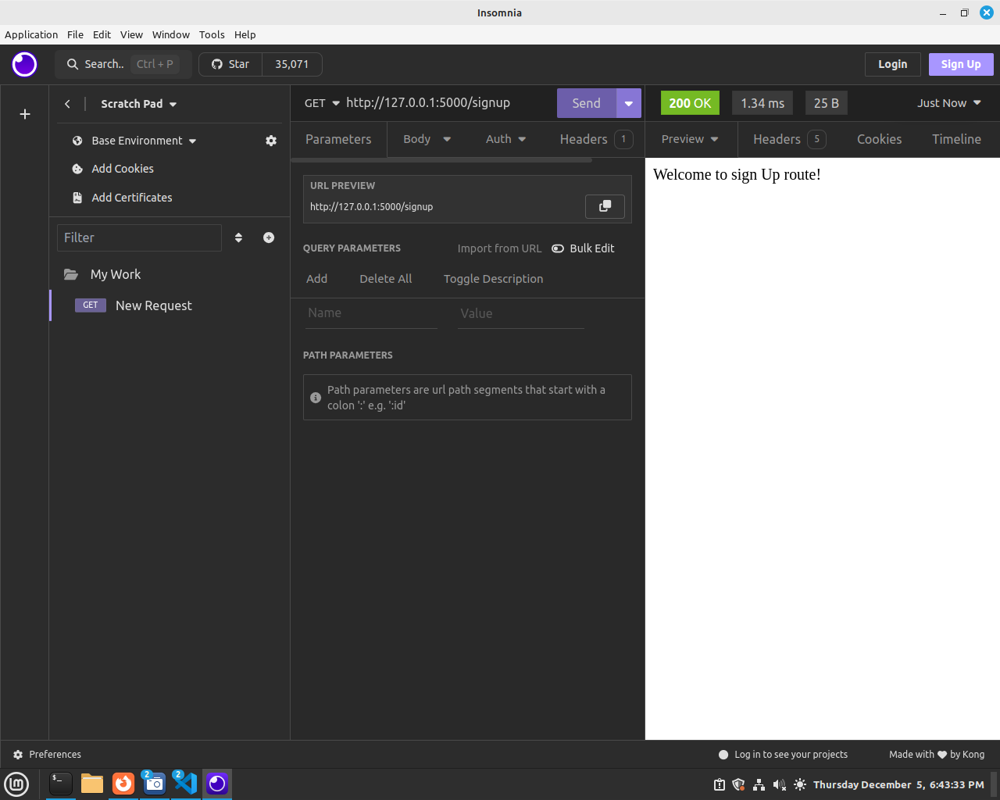
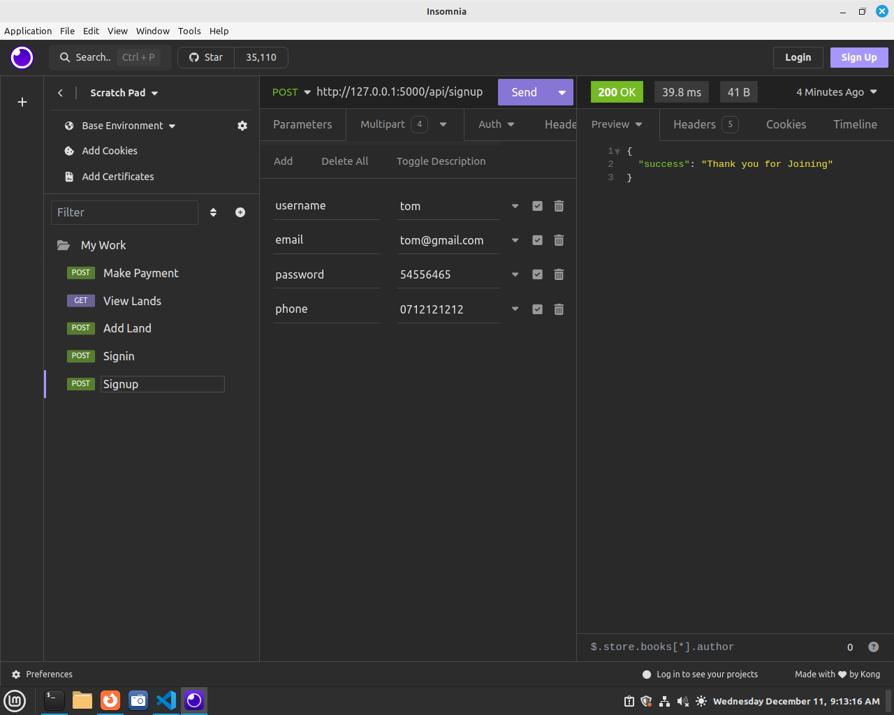
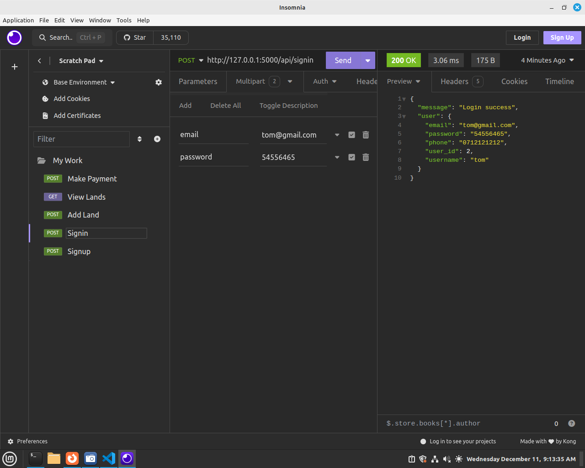
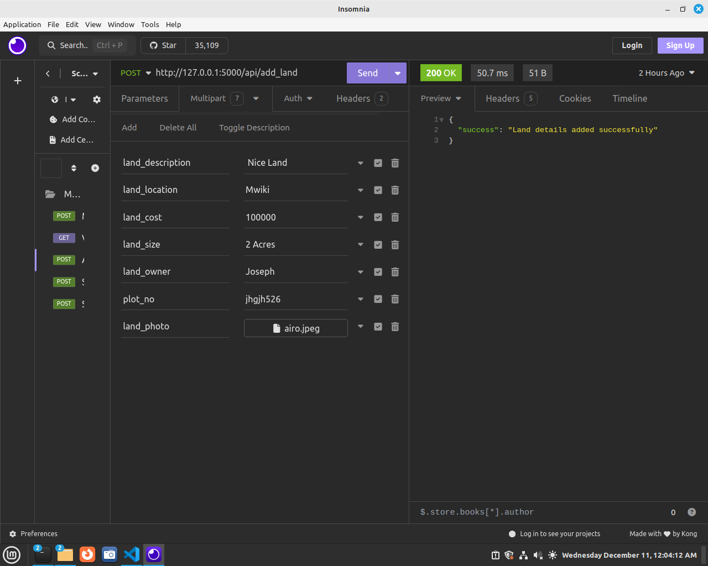
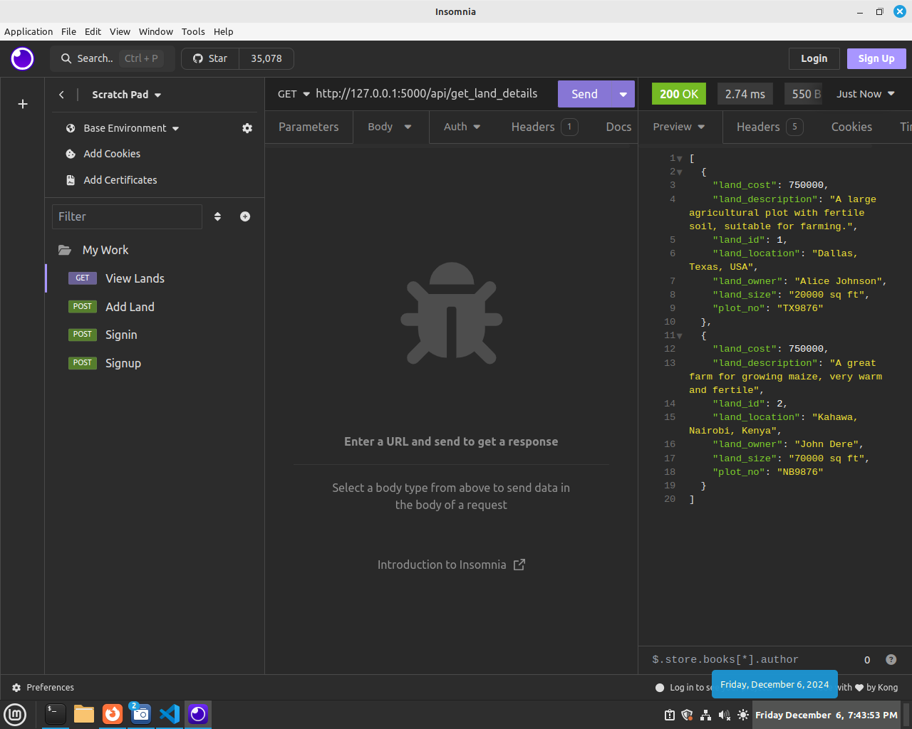
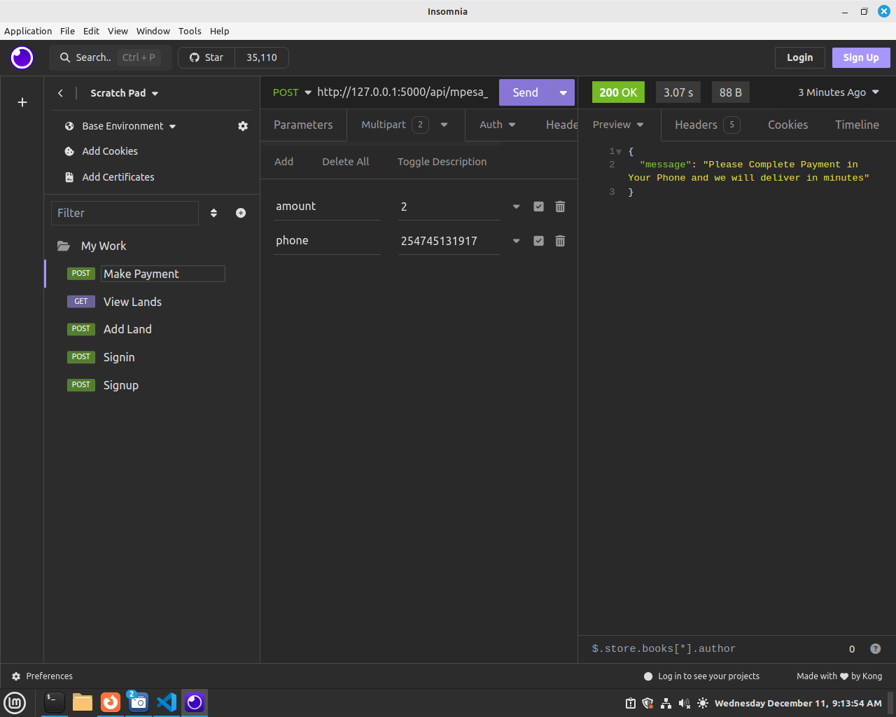

### A Full-Stack Lands Management System (Buy or Sell) with Flask, MySQL, React JS, and MPESA Payment Integration

In this Module, You will creating a Complete Full-Stack Land (Selling and Buying System) management application(LMS) built with Flask for the backend, MySQL for the database, and React JS for the frontend. The application allows users to register, log in, browse products, upload products and make payments via MPESA, a popular mobile money service. Here’s how each component functions in the system.

The Flask backend serves as the Backend layer, providing several key functions:

2. Backend (Flask)

    User Authentication: The backend handles user registration and login, storing users’ details (like emails and hashed passwords) in the MySQL database.
     
    Land Management: The application retrieves land details from the MySQL database, including land location, price, owner details, plot No, etc and send it to the frontend for buyers to see the details. It also handles user signup, signin, land addition, land search and view, and payment processing.

    MPESA Payment: When users are ready to pay, the backend interacts with the MPESA API to initiate and confirm mobile payments. Once the payment is complete, the backend updates product stock if necessary.

3. Database (MySQL)

The database stores the essential information for the application:

Users Table: Contains user details (name, email, password).
Lands Table: Stores land details like name, description, price, and location.

4. MPESA Payment Integration

    Payment Initiation: After selecting products, the user is asked to pay via MPESA. The backend sends a request to MPESA API with payment details.
    Payment Confirmation: MPESA sends a callback to confirm whether the payment was successful. If successful, the backend updates product availability and notifies the user.

<b>Technologies Used</b>
Frontend: React JS for building the user interface and interacting with the Flask API.
Backend: Flask for handling user authentication, managing land, and processing MPESA payments.
Database: MySQL for storing user and doctors information.
Payment: MPESA API for handling mobile money payments.

## Step 1: Creating MySQL Database.
To build a shopping system with Flask and MySQL, the first step is to create a MySQL database. The database will store important data such as user information (names, emails, passwords) and product details (names, descriptions, prices, quantities).

Here’s a brief explanation of the tools involved:

What is XAMPP?
XAMPP is a software package that provides a simple way to set up a local web server environment. It includes:

Apache: A web server software to serve your websites.
MySQL: A popular database management system used to store data.

To Install XAMPP check these Links
https://www.apachefriends.org/download.html

After XAMPP installation, Create a Database named "BackendAPI" and create two tables below are SQL for creating the Tables. NB: You can use your existing Class Database

Users Table

        CREATE TABLE users (
            user_id INT AUTO_INCREMENT PRIMARY KEY,
            username VARCHAR(50) NOT NULL,
            password VARCHAR(50) NOT NULL,
            email VARCHAR(50) NOT NULL,
            phone VARCHAR(50)
        );

        

Lands Table
       
      CREATE TABLE land_details (
            land_id INT AUTO_INCREMENT PRIMARY KEY,  -- Unique identifier for each land entry
            land_description TEXT,                   -- Description of the land
            land_location VARCHAR(255),              -- Location of the land
            land_cost INT,                           -- Cost of the land as an integer (no decimal places)
            land_size VARCHAR(50),                   -- Size of the land
            land_owner VARCHAR(255),                 -- Name of the land owner
            plot_no VARCHAR(50)                      -- Plot number of the land
            land_photo VARCHAR(100)                  -- Photo of the land
        );

Now that we have a Database with Tables, Next step is to create a Python Application to interact with this Database.

## Step 1-1: Flask Framework
Flask is a popular web framework for building web applications in Python. It's designed to be simple, lightweight, and flexible, making it a great choice for developers who are learning web development. Here's an introduction to Flask.

<b>Key Features of Flask: </b>

Easy to Use: Flask is friendly due to its design and minimal setup. You can start building a web application with just a few lines of code. Flask is a good choice for backend development when creating advanced applications.

Python-Based: Since Flask is a Python framework, if you are familiar with Python, you will find it relatively easy to get started. Flask allows you to focus on building the logic and features of your app rather than dealing with complex configurations.

Routing: One of the most important features of Flask is routing, which allows you to map specific URLs to Python functions. For example, you can define a route for your homepage (/), and when someone visits your website, Flask will call the corresponding function to show the page.

Development Server: Flask comes with a built-in development server that makes testing and debugging applications easier. It automatically reloads when you make changes to the code.

Extensible: Flask can be extended with many plugins to handle more complex tasks, such as database integration (using SQLAlchemy), form validation, authentication, and more.

Security: It provides many tools and best practices that you can use to build secure web applications.

Popularity: Flask is extremely popular and in high demand, largely due to its use of Python, one of the most widely used and loved programming languages in the world. Here’s why Flask’s popularity is growing, and why it's in demand:

<b>Conclusion</b>:
Flask is popular and in demand primarily due to its use of Python, one of the most loved and versatile programming languages. Its simplicity, flexibility, and ability to integrate well with modern tools have made it a go-to framework for developers building everything from simple web apps to advanced systems. Whether you're building APIs, microservices, or integrating machine learning models, Flask's growing popularity and demand in the tech industry make it an excellent choice for backend development.

## Step 2: API Creation Development using Flask
What is an API?

API stands for Application Programming Interface. It is a set of rules that allows different software applications to communicate with each other. APIs define the methods and data formats that applications can use to request and exchange information.

In the context of web development:

An API allows a frontend (like a website or mobile app) to interact with a backend server.
The backend exposes various endpoints that the frontend can send requests to (like fetching product data, registering a user, or processing payments).
APIs typically use HTTP methods like GET (retrieve data), POST (send data), PUT (update data), and DELETE (remove data).

For example, our Lands system will have an API to handle user registration, login, and retrieving land listings etc.

## Step 3: Setting Up Flask restful
Install Flask if you haven't already:
   
     pip install flask

Create a New Folder(Create a Class Folder this Project), inside this folder, create below flask app structure.
Inside app.py write below code.

        from flask import *

        # Create the Flask application instance
        app = Flask(__name__)

        # Define a simple route
        @app.route('/signup')
        def signup():
            return "Welcome to sign Up API!"

        # Run the app if this file is executed directly
        if __name__ == '__main__':
            app.run(debug=True)

Test this code in Insomnia -  Insomnia is a popular, open-source API client used for testing, debugging, and interacting with RESTful APIs.

Output

Done, we have already done and tested our first API

## Step 4: Create a SignUp API.
When you refer to signup, it typically means the process where users register their details to create an account on a website or application. During the signup process, users provide certain information (e.g., username, email, password) that is stored in the system to uniquely identify them and allow them to access features of the application.

First install pymysql

    pip install pymysql

Then import pymysql like below.

    import pymysql

An endpoint in web development and APIs is a specific URL that allows you to access or interact with the API.
Read more with an Example in Below Link
https://justpaste.it/fznuk

Check what is a JSON Object   > https://justpaste.it/gxpd9

Update your /api/signup route as follows.
Below is the updated app.py

        from flask import *
        # Create the Flask application instance
        app = Flask(__name__)
        import pymysql

        # Define the sign up Endpoint
        @app.route('/api/signup', methods = ['POST'])
        def signup():
            if request.method =='POST':
                username = request.form['username']
                email = request.form['email']
                password = request.form['password']
            
                # Connect to DB
                connection = pymysql.connect(host='localhost', user='root',
                                                password='',database='BackendAPI')
                # Do insert query
                cursor = connection.cursor()
                cursor.execute('insert into users(username,email,password)values(%s,%s,%s)',
                                    (username, email, password))
                
                # we need to make a commit to changes to dbase
                connection.commit()
                return jsonify({"success": "Thank you for Joining"})

            else: # this means POST was not used, show the signup template
                return jsonify({"error": "Registration Failed, Try again later"})

        # Run the app if this file is executed directly
        if __name__ == '__main__':
            app.run(debug=True)

RUn your flask app, The above api can be accessed through  http://127.0.0.1:5000/api/signup   ,  http://127.0.0.1:5000/being the base url and api/signup  is the specific endpoints your API resource.

Test above api in Insomnia.
NB: In insomnia create a New Folder to store requests (Also rename your requests).
In below requests we use http://127.0.0.1:5000/api/signup as the endpoint, we use POST and the body is exactly as they are defined in our /api/signup Endpoint request variables.

## Step 5: Create a Signin API.
Below API endpoint will allow users to Signin using credentials provided in /api/signup in Step 4 above. Update your app.py by adding an /api/signin route as shown below.

# Define the sign in Endpoint
    import pymysql.cursors
    @app.route('/api/signin', methods = ['POST'])
    def signin():
        if request.method == 'POST':
            data = request.json
            email = data['email']
            password = data['password']  
            
            # Connect to DB
            connection = pymysql.connect(host='localhost', user='root',
                                            password='',database='BackendAPI')
            
            cursor = connection.cursor(pymysql.cursors.DictCursor)
            sql = "select * from users where email = %s and password = %s"
            data = (email, password)
            cursor.execute(sql,data)
            
            #  Check how many rows are found
            count = cursor.rowcount
            # If rows a zero, Invalid Credentials
            if count == 0:
                return jsonify({"message": "Login Failed"})
            else:
                # else there is a user, return a message to say login success and all user details
                user = cursor.fetchone()
                
                # Return login success message with user details as a tuple
                return jsonify({"message": "Login Success", "user": user})

NB: Above we imported import pymysql.cursors  and used in the cursor cursor = connection.cursor(pymysql.cursors.DictCursor), this will help in returning the user details in a Key Value representation.

Your complete app.py now looks like below.

        from flask import *

        # Create the Flask application instance
        app = Flask(__name__)
        import pymysql

        # Define the sign up Endpoint
        @app.route('/api/signup', methods = ['POST'])
        def signup():
            if request.method =='POST':
                username = request.form['username']
                email = request.form['email']
                password = request.form['password']
            
                # COnnect to DB
                connection = pymysql.connect(host='localhost', user='root',
                                                password='',database='BackendAPI')
                # Do insert query
                cursor = connection.cursor()
                cursor.execute('insert into users(username,email,password)values(%s,%s,%s)',
                                    (username, email, password))
                
                # we need to make a commit to changes to dbase
                connection.commit()
                return jsonify({"success": "Thank you for Joining"})

        # Define the sign in Endpoint
        import pymysql.cursors
        @app.route('/api/signin', methods = ['POST'])
        def signin():
            if request.method == 'POST':
                email = request.form['email']
                password = request.form['password']  
                
                # Connect to DB
                connection = pymysql.connect(host='localhost', user='root',
                                                password='',database='BackendAPI')
                
                cursor = connection.cursor(pymysql.cursors.DictCursor)
                sql = "select * from users where email = %s and password = %s"
                data = (email, password)
                cursor.execute(sql,data)
                
                #  Check how many rows are found
                count = cursor.rowcount
                # If rows a zero, Invalid Credentials
                if count == 0:
                    return jsonify({"message": "Login Failed"})
                else:
                    # else there is a user, return a message to say login success and all user details
                    user = cursor.fetchone()
                    
                    # Return login success message with user details as a tuple
                    return jsonify({"message": "Login success", "user": user})
                

        # Run the app if this file is executed directly
        if __name__ == '__main__':
            app.run(debug=True)

## Step 6: Create a Land upload API.
This endpoint will be used by users in uploading their land details
First create Folder named static in your Flask folder.
Inside static create a subfolder named images. (This is where the land photos will be uploaded)

In app.py add below lines to set up Upload directory
You can place then Just below <b>app = Flask(__name__) </b>

    # setup file upload
    import os
    app.config['UPLOAD_FOLDER'] = 'static/images'

In app.py add below route to create the API Endpoint

    # Define the Add Land Endpoint
    @app.route('/api/add_land', methods=['POST'])
    def add_land():
        if request.method == 'POST':
            # data = request.json
            land_description = request.form['land_description']
            land_location = request.form['land_location']
            land_cost = request.form['land_cost']
            land_size = request.form['land_size']
            land_owner = request.form['land_owner']
            plot_no = request.form['plot_no']
            photo = request.files['land_photo']
            filename = photo.filename
            photo_path = os.path.join(app.config['UPLOAD_FOLDER'], filename)
            photo.save(photo_path)
        
            # Connect to DB
            connection = pymysql.connect(host='localhost', user='root',
                                            password='', database='BackendAPI')
            # Prepare and execute the insert query
            cursor = connection.cursor()
            cursor.execute('INSERT INTO land_details (land_description, land_location, land_cost, land_size, land_owner, plot_no, land_photo) '
                        'VALUES (%s, %s, %s, %s, %s, %s, %s)',
                        (land_description, land_location, land_cost, land_size, land_owner, plot_no, filename))
            
            # Commit the changes to the database
            connection.commit()
            return jsonify({"success": "Land details added successfully"})

Test above in insomnia
When testing above, we will not use JSON, instead we use multipart, in insomnia switch to Multipart Form and provide key and value pairs of your data.
NB: land_pho must be provided as a File since its an Image.

## Step 7: Create a View Available Lands  API.
This endpoint will be used by users to View Posted lands
In app.py add below route to create the API Endpoint.

Check more JSON Array > https://justpaste.it/gxpd9

    # Define the Get Land Details Endpoint
    @app.route('/api/get_land_details', methods=['GET'])
    def get_land_details():
        # Connect to the database with DictCursor for direct dictionary results
        connection = pymysql.connect(host='localhost', user='root',
                                        password='', database='BackendAPI')
        
        # Create a cursor object and fetch all land details from the land_details table
        cursor = connection.cursor(pymysql.cursors.DictCursor)
        cursor.execute('SELECT * FROM land_details')
        land_details = cursor.fetchall()
        
        # Close the database connection
        connection.close()
        
        # Return the land details directly as JSON
        return jsonify(land_details)

Test in Insmnia
In below image shows a JSON Array showing several lands displayed
Output

## Step 8: Making an MPESA Payment API.
The API Endpoint below will be used for any payment to be done in our land Management System.
We will use MPESA Daraja Intergration. Please check https://developer.safaricom.co.ke/

NB: you will need to install requests if not already installed.

    pip install requests

In app.py add below code

    # Mpesa Payment Route 
    import requests
    import datetime
    import base64
    from requests.auth import HTTPBasicAuth

    @app.route('/api/mpesa_payment', methods=['POST'])
    def mpesa_payment():
        if request.method == 'POST':
            amount = request.form['amount']
            phone = request.form['phone']
            # GENERATING THE ACCESS TOKEN
            # create an account on safaricom daraja
            consumer_key = "GTWADFxIpUfDoNikNGqq1C3023evM6UH"
            consumer_secret = "amFbAoUByPV2rM5A"

            api_URL = "https://sandbox.safaricom.co.ke/oauth/v1/generate?grant_type=client_credentials"  # AUTH URL
            r = requests.get(api_URL, auth=HTTPBasicAuth(consumer_key, consumer_secret))

            data = r.json()
            access_token = "Bearer" + ' ' + data['access_token']

            #  GETTING THE PASSWORD
            timestamp = datetime.datetime.today().strftime('%Y%m%d%H%M%S')
            passkey = 'bfb279f9aa9bdbcf158e97dd71a467cd2e0c893059b10f78e6b72ada1ed2c919'
            business_short_code = "174379"
            data = business_short_code + passkey + timestamp
            encoded = base64.b64encode(data.encode())
            password = encoded.decode('utf-8')

            # BODY OR PAYLOAD
            payload = {
                "BusinessShortCode": "174379",
                "Password": "{}".format(password),
                "Timestamp": "{}".format(timestamp),
                "TransactionType": "CustomerPayBillOnline",
                "Amount": "1",  # use 1 when testing
                "PartyA": phone,  # change to your number
                "PartyB": "174379",
                "PhoneNumber": phone,
                "CallBackURL": "https://modcom.co.ke/api/confirmation.php",
                "AccountReference": "account",
                "TransactionDesc": "account"
            }

            # POPULAING THE HTTP HEADER
            headers = {
                "Authorization": access_token,
                "Content-Type": "application/json"
            }

            url = "https://sandbox.safaricom.co.ke/mpesa/stkpush/v1/processrequest"  # C2B URL

            response = requests.post(url, json=payload, headers=headers)
            print(response.text)
            return jsonify({"message": "Please Complete Payment in Your Phone and we will deliver in minutes"})

Test in Insomnia

Your Final app.py looks like below

    from flask import *

    # Create the Flask application instance
    app = Flask(__name__)
    # setup file upload
    import os
    app.config['UPLOAD_FOLDER'] = 'static/images'

    import pymysql

    # Define the sign up Endpoint
    @app.route('/api/signup', methods = ['POST'])
    def signup():
        if request.method =='POST':
            username = request.form['username']
            email = request.form['email']
            password = request.form['password']
            phone = request.form['phone']
        
            # Connect to DB
            connection = pymysql.connect(host='localhost', user='root',
                                            password='',database='BackendAPI')
            # Do insert query
            cursor = connection.cursor()
            cursor.execute('insert into users(username,email,password)values(%s,%s,%s)',
                                (username, email, password))
            
            # we need to make a commit to changes to dbase
            connection.commit()
            return jsonify({"success": "Thank you for Joining"})

    # Define the sign in Endpoint
    import pymysql.cursors
    @app.route('/api/signin', methods = ['POST'])
    def signin():
        if request.method == 'POST':
            email = request.form['email']
            password = request.form['password'] 
            
            # Connect to DB
            connection = pymysql.connect(host='localhost', user='root',
                                            password='',database='BackendAPI')
            
            cursor = connection.cursor(pymysql.cursors.DictCursor)
            sql = "select * from users where email = %s and password = %s"
            data = (email, password)
            cursor.execute(sql,data)
            
            #  Check how many rows are found
            count = cursor.rowcount
            # If rows a zero, Invalid Credentials
            if count == 0:
                return jsonify({"message": "Login Failed"})
            else:
                # else there is a user, return a message to say login success and all user details
                user = cursor.fetchone()
                
                # Return login success message with user details as a tuple
                return jsonify({"message": "Login success", "user": user})
            

    # Define the Add Land Endpoint
    @app.route('/api/add_land', methods=['POST'])
    def add_land():
        if request.method == 'POST':
            # data = request.json
            land_description = request.form['land_description']
            land_location = request.form['land_location']
            land_cost = request.form['land_cost']
            land_size = request.form['land_size']
            land_owner = request.form['land_owner']
            plot_no = request.form['plot_no']
            photo = request.files['land_photo']
            filename = photo.filename
            photo_path = os.path.join(app.config['UPLOAD_FOLDER'], filename)
            photo.save(photo_path)
        
            # Connect to DB
            connection = pymysql.connect(host='localhost', user='root',
                                            password='', database='BackendAPI')
            # Prepare and execute the insert query
            cursor = connection.cursor()
            cursor.execute('INSERT INTO land_details (land_description, land_location, land_cost, land_size, land_owner, plot_no, land_photo) '
                        'VALUES (%s, %s, %s, %s, %s, %s, %s)',
                        (land_description, land_location, land_cost, land_size, land_owner, plot_no, filename))
            
            # Commit the changes to the database
            connection.commit()
            return jsonify({"success": "Land details added successfully"})

    # Define the Get Land Details Endpoint
    @app.route('/api/get_land_details', methods=['GET'])
    def get_land_details():
        # Connect to the database with DictCursor for direct dictionary results
        connection = pymysql.connect(host='localhost', user='root',
                                        password='', database='BackendAPI')
        
        # Create a cursor object and fetch all land details from the land_details table
        cursor = connection.cursor(pymysql.cursors.DictCursor)
        cursor.execute('SELECT * FROM land_details')
        land_details = cursor.fetchall()
        
        # Close the database connection
        connection.close()
        
        # Return the land details directly as JSON
        return jsonify(land_details)

    # Mpesa Payment Route 
    import requests
    import datetime
    import base64
    from requests.auth import HTTPBasicAuth

    @app.route('/api/mpesa_payment', methods=['POST'])
    def mpesa_payment():
        if request.method == 'POST':
            amount = request.form['amount']
            phone = request.form['phone']
            # GENERATING THE ACCESS TOKEN
            # create an account on safaricom daraja
            consumer_key = "GTWADFxIpUfDoNikNGqq1C3023evM6UH"
            consumer_secret = "amFbAoUByPV2rM5A"

            api_URL = "https://sandbox.safaricom.co.ke/oauth/v1/generate?grant_type=client_credentials"  # AUTH URL
            r = requests.get(api_URL, auth=HTTPBasicAuth(consumer_key, consumer_secret))

            data = r.json()
            access_token = "Bearer" + ' ' + data['access_token']

            #  GETTING THE PASSWORD
            timestamp = datetime.datetime.today().strftime('%Y%m%d%H%M%S')
            passkey = 'bfb279f9aa9bdbcf158e97dd71a467cd2e0c893059b10f78e6b72ada1ed2c919'
            business_short_code = "174379"
            data = business_short_code + passkey + timestamp
            encoded = base64.b64encode(data.encode())
            password = encoded.decode('utf-8')

            # BODY OR PAYLOAD
            payload = {
                "BusinessShortCode": "174379",
                "Password": "{}".format(password),
                "Timestamp": "{}".format(timestamp),
                "TransactionType": "CustomerPayBillOnline",
                "Amount": "1",  # use 1 when testing
                "PartyA": phone,  # change to your number
                "PartyB": "174379",
                "PhoneNumber": phone,
                "CallBackURL": "https://modcom.co.ke/api/confirmation.php",
                "AccountReference": "account",
                "TransactionDesc": "account"
            }

            # POPULAING THE HTTP HEADER
            headers = {
                "Authorization": access_token,
                "Content-Type": "application/json"
            }

            url = "https://sandbox.safaricom.co.ke/mpesa/stkpush/v1/processrequest"  # C2B URL

            response = requests.post(url, json=payload, headers=headers)
            print(response.text)
            return jsonify({"message": "Please Complete Payment in Your Phone and we will deliver in minutes"})
        

    # Run the app if this file is executed directly
    if __name__ == '__main__':
        app.run(debug=True)

In order to allow this API be accessible by the Front End system to be created.
We need to enable CORS.
Read more on CORS.
https://blog.postman.com/what-is-cors/

First install CORS in Flask

        pip install flask-cors

Then import CORS and Configure in your app
   
        from flask_cors import CORS
        CORS(app)

You can add above code just below  <b>app = Flask(__name__) </b>

In this Github repo, we created an API for Land Management System for Posting and buying Land,
The application provides an API to signup, signin, add_land, get_lands_details and MPESA payment integration. This API creates the Back - End of our full-stack application.

Above API will be accessed in the Front - End (User Side) by Reacct JS and Android Application.
Next is Front - End Development using React JS and later Android Apps.

Happy Coding!