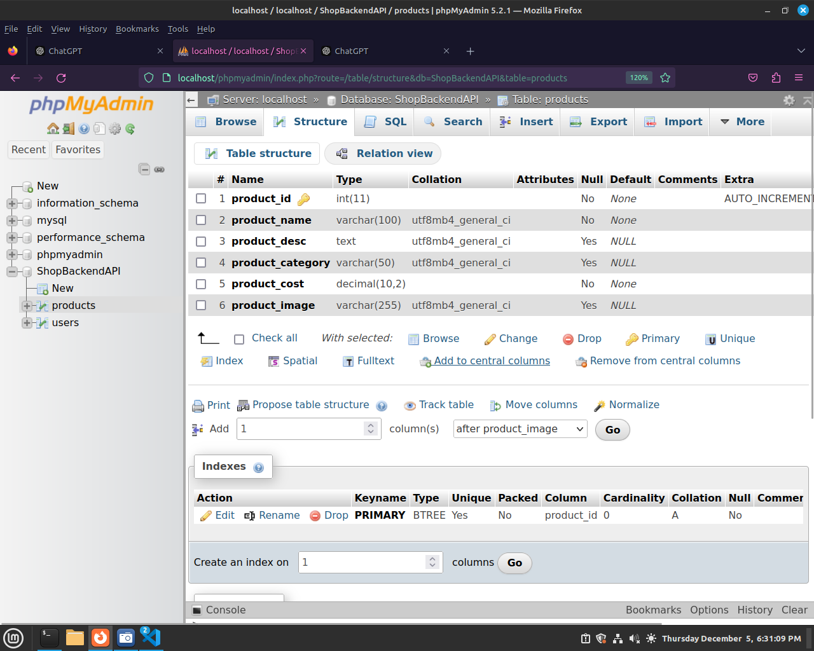
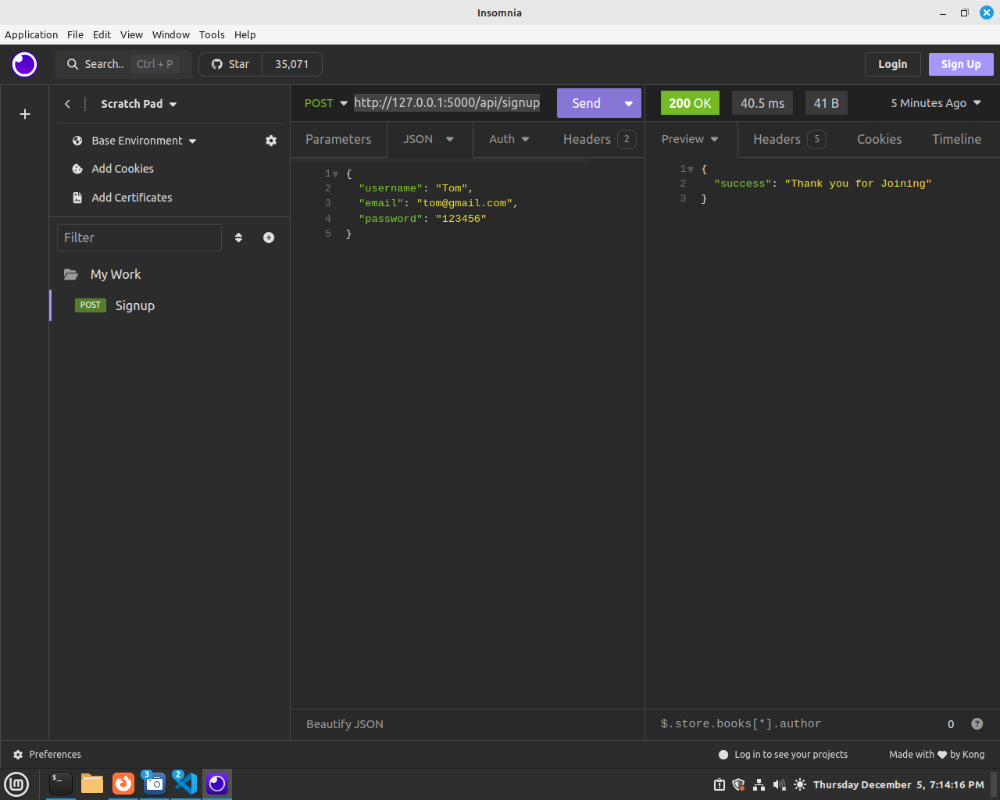

### A Full-Stack Shopping System with Flask, MySQL, React JS, and MPESA Payment Integration

This is a full-stack shopping application built with Flask for the backend, MySQL for the database, and React JS for the frontend. The application allows users to register, log in, browse products, and make payments via MPESA, a popular mobile money service. Here’s how each component functions in the system.

The Flask backend serves as the API layer, providing several key functions:

2. Backend (Flask)

    User Authentication: The backend handles user registration and login, storing users’ details (like emails and hashed passwords) in the MySQL database.
    Product Management: The backend retrieves product data from the MySQL database and sends it to the frontend for display.
    MPESA Payment: When users are ready to pay, the backend interacts with the MPESA API to initiate and confirm mobile payments. Once the payment is complete, the backend updates product stock if necessary.

3. Database (MySQL)

The database stores the essential information for the application:

    Users Table: Contains user details (name, email, password).
    Products Table: Stores product details like name, description, price, and quantity.

4. MPESA Payment Integration

    Payment Initiation: After selecting products, the user is asked to pay via MPESA. The backend sends a request to MPESA API with payment details.
    Payment Confirmation: MPESA sends a callback to confirm whether the payment was successful. If successful, the backend updates product availability and notifies the user.

Technologies Used

Frontend: React JS for building the user interface and interacting with the Flask API.
Backend: Flask for handling user authentication, managing products, and processing MPESA payments.
Database: MySQL for storing user and product information.
Payment: MPESA API for handling mobile money payments.

## Step 1: Creating MySQL Database.
To build a shopping system with Flask and MySQL, the first step is to create a MySQL database. The database will store important data such as user information (names, emails, passwords) and product details (names, descriptions, prices, quantities).

Here’s a brief explanation of the tools involved:

What is XAMPP?
XAMPP is a software package that provides a simple way to set up a local web server environment. It includes:

    Apache: A web server software to serve your websites.
    MySQL: A popular database management system used to store data.
To Install XAMPP check these Links
https://www.apachefriends.org/download.html

After XAMPP installation, Create a Database named "ShopBackendAPI" and create two tables below are SQL for creating the Tables.

Users Table
        CREATE TABLE users (
            user_id INT AUTO_INCREMENT PRIMARY KEY,
            username VARCHAR(50) NOT NULL,
            password VARCHAR(50) NOT NULL,
            email VARCHAR(50) NOT NULL,
            phone VARCHAR(50)
        );

        

Products Table
        CREATE TABLE products (
            product_id INT AUTO_INCREMENT PRIMARY KEY,
            product_name VARCHAR(100) NOT NULL,
            product_desc TEXT,
            product_category VARCHAR(50),
            product_cost DECIMAL(10, 2) NOT NULL,
            product_image VARCHAR(255)
        );

## Step 2: API Creation Development using Flask_restful.
What is an API?

API stands for Application Programming Interface. It is a set of rules and protocols that allows different software applications to communicate with each other. APIs define the methods and data formats that applications can use to request and exchange information.

In the context of web development:

    An API allows a frontend (like a website or mobile app) to interact with a backend server.
    The backend exposes various endpoints that the frontend can send requests to (like fetching product data, registering a user, or processing payments).
    APIs typically use HTTP methods like GET (retrieve data), POST (send data), PUT (update data), and DELETE (remove data).

For example, our shopping app will have an API to handle user registration, login, and retrieving product listings etc.

## Step 3: Setting Up Flask restful
Install Flask if you haven't already:
   
     pip install flask

Create a New Folder named ShopBackendAPI, inside this folder, create below flask app structure.
Inside app.py write below code.

        from flask import *

        # Create the Flask application instance
        app = Flask(__name__)

        # Define a simple route
        @app.route('/signup')
        def signup():
            return "Welcome to sign Up route!"

        # Run the app if this file is executed directly
        if __name__ == '__main__':
            app.run(debug=True)

Test this code in Insomnia -  Insomnia is a popular, open-source API client used for testing, debugging, and interacting with RESTful APIs.

Done, we have already done and tested our first API

## Step 4: Create a SignUp API.
When you refer to signup, it typically means the process where users register their details to create an account on a website or application. During the signup process, users provide certain information (e.g., username, email, password) that is stored in the system to uniquely identify them and allow them to access features of the application.

First install pymysql

    pip install pymysql

Then import pymysql like below.

    import pymysql

An endpoint in web development and APIs is a specific URL that allows you to access or interact with a resource on a web server like an (API).

Update your /api/signup route as follows.
Below is the updated app.py

        from flask import *
        # Create the Flask application instance
        app = Flask(__name__)
        import pymysql

        # Define the sign up Endpoint
        @app.route('/api/signup', methods = ['POST'])
        def signup():
            if request.method =='POST':
                data = request.json
                username = data['username']
                email = data['email']
                password = data['password']
            
                # COnnect to DB
                connection = pymysql.connect(host='localhost', user='root',
                                                password='',database='ShopBackendAPI')
                # Do insert query
                cursor = connection.cursor()
                cursor.execute('insert into users(username,email,password)values(%s,%s,%s)',
                                    (username, email, password))
                
                # we need to make a commit to changes to dbase
                connection.commit()
                return jsonify({"success": "Thank you for Joining"})

            else: # this means POST was not used, show the signup template
                return jsonify({"error": "Registration Failed, Try again later"})

        # Run the app if this file is executed directly
        if __name__ == '__main__':
            app.run(debug=True)

RUn your flask app, The above api can be accessed through  http://127.0.0.1:5000/api/signup   ,  http://127.0.0.1:5000/being the base url and api/signup  is the specific endpoints your API resource.

Test above api in Insomnnia.
NB: In insomnia create a New Folder to store requests (Also rename your requests).
In below requests we use http://127.0.0.1:5000/api/signup as the endpoint, we use POST and the body is exactly as they are defined in our /api/signup Endpoint.

