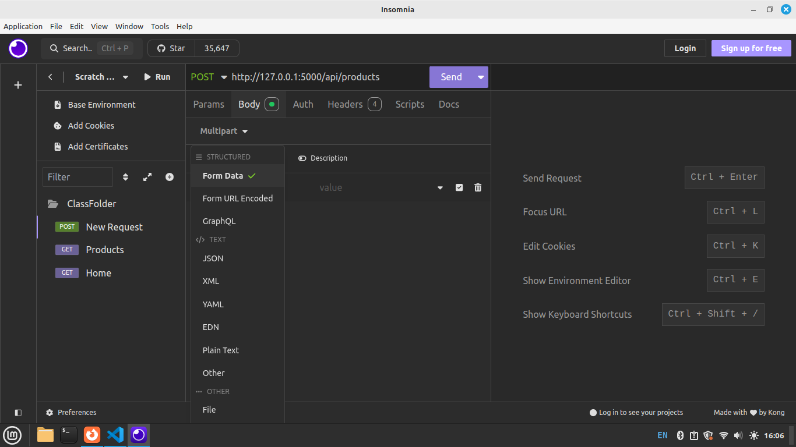
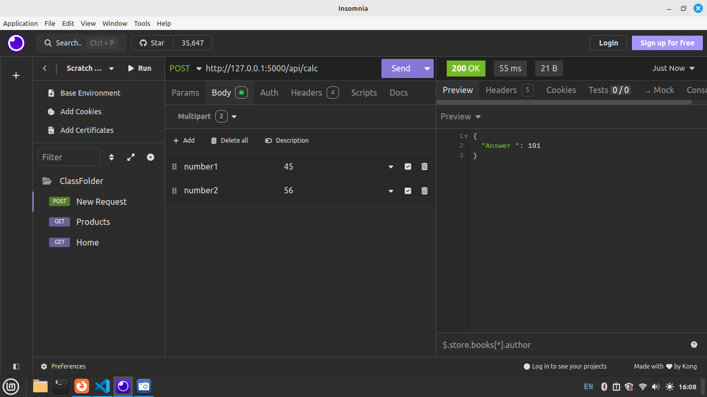

### A Full-Stack E-commerce (Buy or Sell Products) with Flask, MySQL, React JS, and MPESA Payment Integration
<b>Introduction</b> <br/>
In this Module, You will be creating a Complete Full-Stack commerce Web Application(Selling and Buying System)  built with Flask for the backend, MySQL for the database, and React JS for the frontend.
We will Call This Application <h3><b>SOKOGARDEN</b></h3>
<br>
This E-Commerce Web Application is a website where people can buy and sell products online, The application is inspired by growing web applications such Jumia, Kilimall, Alibaba, and Jiji. It Allows users to create account(Signup), Sign in Sell Products, Buy Products, Browse Products, Make MPESA Payment etc.
<br><br>
DEMO the Web Application<br>
Link : https://sokogarden.vercel.app  <br>

The Flask backend serves as the Backend layer, providing several key functions:

2. Backend (Flask)

    User Authentication: The backend handles user registration and login, storing users’ details (like emails and passwords) in the MySQL database.
     
    Product Management: The application retrieves product details from the MySQL database, including product_name, description , cost, photo etc and send it to the frontend for buyers to see the details. It also handles user signup, signin, product addition, product search and view, and payment processing.

    MPESA Payment: When users are ready to pay, the backend interacts with the MPESA API to initiate and confirm mobile payments.

3. Database (MySQL)

The database stores the essential information for the application:

Users Table: Contains user details (name, email, password).
Product Table: Stores products details like name, description, price, and photo.
<br>

4. MPESA Payment Integration

    Payment Initiation: After selecting products, the user is asked to pay via MPESA. The backend sends a request to MPESA API with payment details.

<br>
<b>Technologies Used</b>
Frontend: React JS for building the user interface and interacting with the Flask API.
Backend: Flask for handling user authentication, managing producrs, and processing MPESA payments.
Database: MySQL for storing user and doctors information.
Payment: MPESA API for handling mobile money payments.

### THIS REPO CREATES THE BACKEND ONLY
## Step 1: Creating MySQL Database.
To build a shopping system with Flask and MySQL, the first step is to create a MySQL database. The database will store important data such as user information (names, emails, passwords) and product details (names, descriptions, prices, quantities).
<br/>
Please check our Book4 for SQL Database Setup and Guide.

<br/>
<b><h3>NB: Use your Existing Database</h3></b>
<br/>

In Your Database Create below two tables; <br/>
1. users  -  used to store our system users<br/>
2. product_details - used to store product details/information 
<br/>


<b>Users Table</b>

        CREATE TABLE users (
            user_id INT AUTO_INCREMENT PRIMARY KEY,
            username VARCHAR(50) NOT NULL,
            password VARCHAR(50) NOT NULL,
            email VARCHAR(50) NOT NULL,
            phone VARCHAR(50)
        );


        


<b>Products Table</b>
       
       CREATE TABLE product_details (
            product_id INT AUTO_INCREMENT PRIMARY KEY,
            product_name VARCHAR(255) NOT NULL,
            product_description TEXT,
            product_cost INT,
            product_photo VARCHAR(255)
        );


<br/>
Now that we have a Database with Tables, Next step is to create a Python Application to interact with this Database.
<br/>

## Step 1-1: Flask Framework

Flask is a popular web framework for building web applications in Python. It's designed to be simple, lightweight, and flexible, making it a great choice for developers who are learning web development. Here's an introduction to Flask.

<b>Key Features of Flask: </b>

<b>Easy to Use:</b> Flask is friendly due to its design and minimal setup. You can start building a web application with just a few lines of code. Flask is a good choice for backend development when creating advanced applications.

<b>Python-Based:</b> Since Flask is a Python framework, if you are familiar with Python, you will find it relatively easy to get started. Flask allows you to focus on building the logic and features of your app rather than dealing with complex configurations.

<b>Routing:</b> One of the most important features of Flask is routing, which allows you to map specific URLs to Python functions. For example, you can define a route for your homepage (/), and when someone visits your website, Flask will call the corresponding function to show the page.

<b>Development Server:</b> Flask comes with a built-in development server that makes testing and debugging applications easier. It automatically reloads when you make changes to the code.

<b>Extensible:</b> Flask can be extended with many plugins to handle more complex tasks, such as database integration (using SQLAlchemy), form validation, authentication, and more.

<b>Security: </b> It provides many tools and best practices that you can use to build secure web applications.

<b>Popularity: </b> Flask is extremely popular and in high demand, largely due to its use of Python, one of the most widely used and loved programming languages in the world. Here’s why Flask’s popularity is growing, and why it's in demand:


<b>Conclusion</b>:
Flask is popular and in demand primarily due to its use of Python, one of the most loved and versatile programming languages. Its simplicity, flexibility, and ability to integrate well with modern tools have made it a go-to framework for developers building everything from simple web apps to advanced systems. Whether you're building APIs, microservices, or integrating machine learning models, Flask's growing popularity and demand in the tech industry make it an excellent choice for backend development.


## Step 2: API Creation Development using Flask
What is an API?

API stands for Application Programming Interface. It allows different software applications to communicate with each other. APIs define the functions to exchange information between back end and front end. <br>

API stands for Application Programming Interface:  <br>

<b>A (Application)</b> – A software program or system that performs specific tasks.<br>
<b>P (Programming) </b> – The process of writing code to create program .<br>
<b>I (Interface) </b> – A point of interaction that allows different applications to communicate with each other.<br>

<b>In the context of web development:</b> <br>
An API allows a frontend (like a website or mobile app) to interact with a backend server.
The backend exposes various links or endpoints that the frontend can send requests to (like fetching product data, registering a user, or processing payments).


<br>
In this Module we do the Backend using Python and SQL<br>
For example, our E-commerce Web Application will have an API to handle user registration, login, add  product and retrieving Products listings etc.  Lets Do it Practically!
<br/>


## Step 2.1: Setting Up Flask, Testing Routes
Install Flask module if you haven't installed already:
   
     pip install flask

Create a New Folder(Create a Class Folder for this Project), inside this folder, create a Python File named test.py. <br/>
In this File we first learn the fundamentals on how create and interact with API (Application Programming Interface). Then we will move to Step 3: Where we create our eCommerce API.

in test.py add this code
    
```python
from flask import *

# Create the Flask appl
app = Flask(__name__)
# Define a simple route/Endpoint
# the designated paths or endpoints in a web application that correspond to specific functions
@app.route('/api/home')
def home():
    return jsonify({"message":"Welcome to HOME API!"})

# Run the app if this file is executed directly
if __name__ == '__main__':
    app.run(debug=True)
```

<b>Explanation</b> <br/>
This code creates a basic Flask web application.<br/>
Routes: Paths or endpoints in a web application that correspond to specific functions

1. app = Flask(__name__): Initializes the Flask app.<br/>
2. @app.route('/api/home'): Defines a route for the /signup URL.<br/>
3. def home(): The function that returns the message "Welcome to sign Up API!" when the /api/home route is accessed. Each must be attached to a function to give a fuctionality<br/> The message returned uses jsonify to return response in form of a Key Value Pair (Dictionary)
4. if __name__ == '__main__': Ensures the app runs only when the script is executed directly, not when imported as a module.<br/>
5. app.run(debug=True): Starts the development server with debugging enabled.<br/><br/>

Test this code in Insomnia -  Insomnia is a popular, open-source API client used for testing, debugging, and interacting with APIs.
<br/>
The API running at http://127.0.0.1:5000/   <br/>
For us to access the Home Route we write it in this format http://127.0.0.1:5000/api/home <br>

Use http://127.0.0.1:5000/api/home  while Testing your API in insomnia, http://127.0.0.1:5000/api/home  is also known an endpoint since its the link we use to reach the API <br/>

NB: Insomnia we use GET  -  GET only retrieves data from a server.
<br>
There are two types of messages: requests sent by the client to trigger an action on the server, and responses, the answer that the server sends back as a response. 


<br>
Output


Done, we have tested our first API


In test.py add another endpoint  

```python
    from flask import *

    # Create the Flask appl
    app = Flask(__name__)
    # Define a simple route/Endpoint
    @app.route('/api/home')
    def home():
        return jsonify({"message":"Welcome to HOME API!"})


    # Define a another simple route/Endpoint
    @app.route('/api/products')
    def products():
        return jsonify({"message":"Welcome to PRODUCTS API!"})


    # Run the app if this file is executed directly
    if __name__ == '__main__':
        app.run(debug=True)
```

Use http://127.0.0.1:5000/api/products  while Testing your API in insomnia, http://127.0.0.1:5000/api/products  is also known an endpoint since its the link we use to reach the API <br/>

Output


<b>Students Practice</b> <br>
- Create a route/endpoint named /api/services </>
- Create a function for this route and return a message "Welcome to Our Services API" as Key Value Pair.
- Test this endpoint in Insomnia. NB: Create a new request in insomnia.
<br>

## Step 2.2: Posting variables Request to API and Get Responses
In this example we are going to send a request with two numbers to our API endpoint named /api/calc , the api will process, add the two numbers and return a response with an answer.
<br>

in test.py add the /api/calc Route/endpoint as shown below.

```python
    from flask import *

    # Create the Flask appl
    app = Flask(__name__)
    # Define a simple route/Endpoint
    @app.route('/api/home')
    def home():
        return jsonify({"message":"Welcome to HOME API!"})


    # Define a another simple route/Endpoint
    @app.route('/api/products')
    def products():
        return jsonify({"message":"Welcome to PRODUCTS API!"})

    # Define a another simple route/Endpoint
    @app.route('/api/calc', methods = ['POST'])
    def calc():
        if request.method == 'POST':
            number1 = request.form['number1']
            number2 = request.form['number2']
            sum = int(number1)  + int(number2)
            # Return a dictionary : Key - Value Pairs
            return jsonify({'Answer ': sum})
        

    # Run the app if this file is executed directly
    if __name__ == '__main__':
        app.run(debug=True)
```
<br>
This Flask route /api/calc handles POST requests. It takes two numbers from the form data (number1 and number2), converts them to integers, adds them, and returns the sum as a response.
<br>

Test in Insomnia
When testing Please choose POST as the method and Form Data to send post the two variables number1 and number2, see below on how to pick form data.



See below image on how to append data to the request, we append number1 and number2 with their respective values. 

The API endpoint we are using to access our calc is http://127.0.0.1:5000/api/calc

Output


## Step 3: Setting Up Flask App for Our eCommerce Web Application

Create a New Folder(Create a Class Folder for this Project), inside this folder, create a Python File named app.py. <br/>
In this File we create our API (Application Programming Interface)
<br/>
Inside app.py write below code.

```python
        from flask import *

        # Create the Flask application instance
        app = Flask(__name__)

        # Define a simple route/Endpoint
        @app.route('/api/signup')
        def signup():
            return "Welcome to sign Up API!"

        # Run the app if this file is executed directly
        if __name__ == '__main__':
            app.run(debug=True)
``` 
<br/><br/>
<b>Explanation</b> <br/>
This code creates a basic Flask web application.<br/>

1. app = Flask(__name__): Initializes the Flask app.<br/>
2. @app.route('/signup'): Defines a route for the /signup URL.<br/>
3. def signup(): The function that returns the message "Welcome to sign Up API!" when the /signup route is accessed.<br/>
4. if __name__ == '__main__': Ensures the app runs only when the script is executed directly, not when imported as a module.<br/>
5. app.run(debug=True): Starts the development server with debugging enabled.<br/><br/>


Test this code in Insomnia -  Insomnia is a popular, open-source API client used for testing, debugging, and interacting with APIs.
<br/>
The API running at http://127.0.0.1:5000/   <br/>
For us to access the Signup Route we write it in this format http://127.0.0.1:5000/api/signup <br>

Use http://127.0.0.1:5000/api/signup  while Testing your API in insomnia <br/>

Output


<br>
<br>
