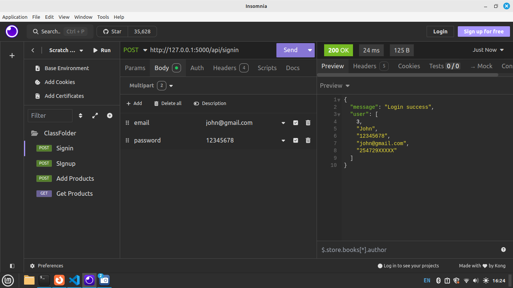
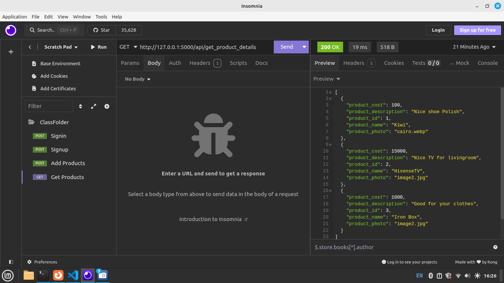
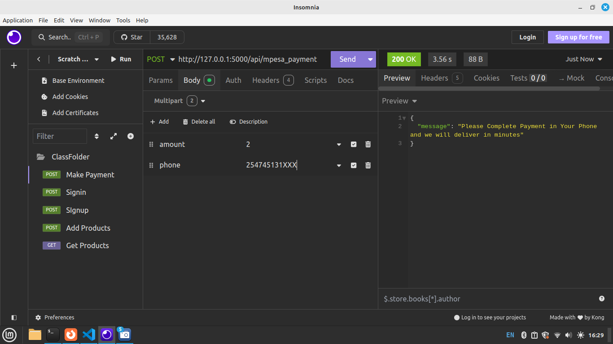

Create a New Folder(Create a Class Folder for this Project), inside this folder, create a Python File named app.py. <br/>
In this File we create our API (Application Programming Interface)
<br/>
Inside app.py write below code.

```python
        from flask import *

        # Create the Flask application instance
        app = Flask(__name__)

        # Define a simple route/Endpoint
        @app.route('/api/signup')
        def signup():
            return "Welcome to sign Up API!"

        # Run the app if this file is executed directly
        if __name__ == '__main__':
            app.run(debug=True)
``` 
<br/><br/>
<b>Explanation</b> <br/>
This code creates a basic Flask web application.<br/>

1. app = Flask(__name__): Initializes the Flask app.<br/>
2. @app.route('/signup'): Defines a route for the /signup URL.<br/>
3. def signup(): The function that returns the message "Welcome to sign Up API!" when the /signup route is accessed.<br/>
4. if __name__ == '__main__': Ensures the app runs only when the script is executed directly, not when imported as a module.<br/>
5. app.run(debug=True): Starts the development server with debugging enabled.<br/><br/>


Test this code in Insomnia -  Insomnia is a popular, open-source API client used for testing, debugging, and interacting with APIs.
<br/>
The API running at http://127.0.0.1:5000/   <br/>
For us to access the Signup Route we write it in this format http://127.0.0.1:5000/api/signup <br>

Use http://127.0.0.1:5000/api/signup  while Testing your API in insomnia <br/>

Output


<br>
<br>

## Step 4: Create a SignUp API.
When you refer to signup, it typically means the process where users register their details to create an account on a website or application. During the signup process, users provide certain information (e.g., username, email, password) that is stored in the system to uniquely identify them and allow them to access features of the application.

First install pymysql

    pip install pymysql

Then import pymysql like below.

    import pymysql

An endpoint in web development and APIs is a specific URL that allows you to access or interact with the API.
i.e http://127.0.0.1:5000/api/signup    is an endpoint


Update your /api/signup route as follows.
Below is the updated app.py
```python
        from flask import *
        # Create the Flask application instance
        app = Flask(__name__)
        import pymysql

        # Define the sign up Endpoint
        @app.route('/api/signup', methods = ['POST'])
        def signup():
            if request.method =='POST':
                username = request.form['username']
                email = request.form['email']
                password = request.form['password']
                phone = request.form['phone']
            
                # COnnect to DB
                connection = pymysql.connect(host='localhost', user='root',
                                                password='',database='BackendAPI')
                # Do insert query
                cursor = connection.cursor()
                cursor.execute('insert into users(username,email,password, phone)values(%s,%s,%s,%s)',
                                    (username, email, password, phone))
                
                # we need to make a commit to changes to dbase
                connection.commit()
                return jsonify({"success": "Thank you for Joining"})


        # Run the app if this file is executed directly
        if __name__ == '__main__':
            app.run(debug=True)
``` 

RUn your flask app, The above api can be accessed through  http://127.0.0.1:5000/api/signup   <br>

<b>Explanation </b> <br/>
This code defines a sign-up endpoint (/api/signup) for handling POST requests.<br/>

1. Request handling: It extracts the username, email, password, and phone from the form data submitted in the POST request.<br/>
2. Database connection: It connects to a MySQL database (BackendAPI) using pymysql and creates a cursor to execute the SQL query that inserts user data into the users table.<br/>
3. Commit changes: The transaction is committed to save the data in the database.<br/>
4. Response: It returns a JSON(Key-Value Pairs-Dictionary)response with a success message: "Thank you for Joining".<br/><br/>


Test above api in Insomnia.
NB: In insomnia create a New Folder to store requests (Also rename your requests).
In below requests we use http://127.0.0.1:5000/api/signup as the endpoint, we use POST and the body is exactly as they are defined in our /api/signup Endpoint request variables.


## Step 5: Create a Signin API.
Below API endpoint will allow users to Signin using credentials provided in /api/signup in Step 4 above. Update your app.py by adding an /api/signin route as shown below.

# Define the sign in Endpoint

```python
    import pymysql.cursors
    @app.route('/api/signin', methods = ['POST'])
    def signin():
        if request.method == 'POST':
            # Extract POST data
            email = request.form['email']
            password = request.form['password']
            
            # Connect to DB
            connection = pymysql.connect(host='localhost', user='root',
                                            password='',database='BackendAPI')
            
            # Create a cursor to return results a dictionary
            cursor = connection.cursor(pymysql.cursors.DictCursor)
            sql = "select * from users where email = %s and password = %s"
            data = (email, password)
            cursor.execute(sql,data)
            
            #  Check how many rows are found
            count = cursor.rowcount
            # If rows a zero, Invalid Credentials - No user Found
            if count == 0:
                return jsonify({"message": "Login Failed"})
            else:
                # else there is a user, return a message to say login success and all user details
                user = cursor.fetchone()
                
                # Return login success message with user details as a dictionary
                return jsonify({"message": "Login Success", "user": user})

```

NB: Above we imported import pymysql.cursors  and used in the cursor cursor = connection.cursor(pymysql.cursors.DictCursor), this will help in returning the user details in a Key Value representation or a Dictionary

Your complete app.py now looks like below.

```python
        from flask import *

        # Create the Flask application instance
        app = Flask(__name__)
        import pymysql

        # Define the sign up Endpoint
        @app.route('/api/signup', methods = ['POST'])
        def signup():
            if request.method =='POST':
                username = request.form['username']
                email = request.form['email']
                password = request.form['password']
            
                # COnnect to DB
                connection = pymysql.connect(host='localhost', user='root',
                                                password='',database='BackendAPI')
                # Do insert query
                cursor = connection.cursor()
                cursor.execute('insert into users(username,email,password)values(%s,%s,%s)',
                                    (username, email, password))
                
                # we need to make a commit to changes to dbase
                connection.commit()
                return jsonify({"success": "Thank you for Joining"})

        # Define the sign in Endpoint
        import pymysql.cursors
        @app.route('/api/signin', methods = ['POST'])
        def signin():
            if request.method == 'POST':
                email = request.form['email']
                password = request.form['password']  
                
                # Connect to DB
                connection = pymysql.connect(host='localhost', user='root',
                                                password='',database='BackendAPI')
                
                cursor = connection.cursor(pymysql.cursors.DictCursor)
                sql = "select * from users where email = %s and password = %s"
                data = (email, password)
                cursor.execute(sql,data)
                
                #  Check how many rows are found
                count = cursor.rowcount
                # If rows a zero, Invalid Credentials
                if count == 0:
                    return jsonify({"message": "Login Failed"})
                else:
                    # else there is a user, return a message to say login success and all user details
                    user = cursor.fetchone()
                    
                    # Return login success message with user details as a tuple
                    return jsonify({"message": "Login success", "user": user})
                


        # Run the app if this file is executed directly
        if __name__ == '__main__':
            app.run(debug=True)

```

Test Signin insomnia.<br/> use http://127.0.0.1:5000/api/signin  as Endpoint <br>



## Step 6: Create a Product upload API.
This endpoint will be used by users in uploading their products details
First create Folder named static in your Flask folder.
Inside static create a subfolder named images. (This is where the products photos will be uploaded)

In app.py add below lines to set up Upload directory where our products image will be uploaded <br>
You can place then Just below <b>app = Flask(__name__) </b>

    # setup file upload
    import os
    app.config['UPLOAD_FOLDER'] = 'static/images'


In app.py add below route to create the API Endpoint

```python
    # Define the Add Product Route/Endpoint
    @app.route('/api/add_product', methods=['POST'])
    def add_product():
        if request.method == 'POST':
            # Extract POST Data
            product_name = request.form['product_name']
            product_description = request.form['product_description']
            product_cost = request.form['product_cost']
            # Extract image data
            photo = request.files['product_photo']
            # Get the image file name
            filename = photo.filename
            # SPecify where the image will be saved (in static Folder) - Image Path
            photo_path = os.path.join(app.config['UPLOAD_FOLDER'], filename)
            # Save your image
            photo.save(photo_path)

            # Connect to DB
            connection = pymysql.connect(host='localhost', user='root',
                                            password='',database='BackendAPI')
            # Prepare and execute the insert query
            cursor = connection.cursor()
            cursor.execute('INSERT INTO product_details (product_name, product_description, product_cost, product_photo) '
                        'VALUES (%s, %s, %s, %s)',
                        (product_name, product_description, product_cost,  filename))

            # Commit the changes to the database
            connection.commit()
            # Return success message in Dictionary Format
            return jsonify({"success": "Product details added successfully"})

```

Test above in insomnia

NB: product_photo must be provided as a File since its an Image.


## Step 7: Create a Get Products  API.
This endpoint will be used by users to View Posted products
In app.py add below route to create the API Endpoint.

```python
    # Define the Get Product Details Route/Endpoint
    import pymysql.cursors
    @app.route('/api/get_product_details', methods=['GET'])
    def get_product_details():

        # Connect to the database with DictCursor for direct dictionary results
        connection = pymysql.connect(host='localhost', user='root',
                                            password='',database='BackendAPI')

        # Create a cursor object and fetch all products details from the products_details table
        cursor = connection.cursor(pymysql.cursors.DictCursor)
        cursor.execute('SELECT * FROM product_details')
        product_details = cursor.fetchall()

        # Close the database connection
        connection.close()

        # Return the products details directly as a dictionay - JSON
        return jsonify(product_details)

```

Test in Insmnia
In below image shows a Dictionary - JSON Array showing several products displayed
Output



## Step 8: Making an MPESA Payment API.
The API Endpoint below will be used for any payment to be done in our E-commerce Web Application.
We will use MPESA Daraja Intergration. Please check https://developer.safaricom.co.ke/


NB: you will need to install requests if not already installed.

    pip install requests

In app.py add below code

```python
    # Mpesa Payment Route 
    import requests
    import datetime
    import base64
    from requests.auth import HTTPBasicAuth

    @app.route('/api/mpesa_payment', methods=['POST'])
    def mpesa_payment():
        if request.method == 'POST':
            amount = request.form['amount']
            phone = request.form['phone']
            # GENERATING THE ACCESS TOKEN
            # create an account on safaricom daraja
            consumer_key = "GTWADFxIpUfDoNikNGqq1C3023evM6UH"
            consumer_secret = "amFbAoUByPV2rM5A"

            api_URL = "https://sandbox.safaricom.co.ke/oauth/v1/generate?grant_type=client_credentials"  # AUTH URL
            r = requests.get(api_URL, auth=HTTPBasicAuth(consumer_key, consumer_secret))

            data = r.json()
            access_token = "Bearer" + ' ' + data['access_token']

            #  GETTING THE PASSWORD
            timestamp = datetime.datetime.today().strftime('%Y%m%d%H%M%S')
            passkey = 'bfb279f9aa9bdbcf158e97dd71a467cd2e0c893059b10f78e6b72ada1ed2c919'
            business_short_code = "174379"
            data = business_short_code + passkey + timestamp
            encoded = base64.b64encode(data.encode())
            password = encoded.decode('utf-8')

            # BODY OR PAYLOAD
            payload = {
                "BusinessShortCode": "174379",
                "Password": "{}".format(password),
                "Timestamp": "{}".format(timestamp),
                "TransactionType": "CustomerPayBillOnline",
                "Amount": "1",  # use 1 when testing
                "PartyA": phone,  # change to your number
                "PartyB": "174379",
                "PhoneNumber": phone,
                "CallBackURL": "https://modcom.co.ke/api/confirmation.php",
                "AccountReference": "account",
                "TransactionDesc": "account"
            }

            # POPULAING THE HTTP HEADER
            headers = {
                "Authorization": access_token,
                "Content-Type": "application/json"
            }

            url = "https://sandbox.safaricom.co.ke/mpesa/stkpush/v1/processrequest"  # C2B URL

            response = requests.post(url, json=payload, headers=headers)
            print(response.text)
            return jsonify({"message": "Please Complete Payment in Your Phone and we will deliver in minutes"})

```

Test in Insomnia <br/>


<br>
Your Final app.py looks like below

```python   
    # THIS IS AN API FOR Ecommerce Backend
    from flask import *

    # Create the Flask application instance
    app = Flask(__name__)

    # setup file upload
    import os
    app.config['UPLOAD_FOLDER'] = 'static/images'
    import pymysql


    # Define the sign up Route/Endpoint
    @app.route('/api/signup', methods = ['POST'])
    def signup():
        if request.method =='POST':
            username = request.form['username']
            email = request.form['email']
            password = request.form['password']
            phone = request.form['phone']
        
            # COnnect to DB
            connection = pymysql.connect(host='localhost', user='root',
                                            password='',database='BackendAPI')
            # Do insert query
            cursor = connection.cursor()
            cursor.execute('insert into users(username,email,password, phone)values(%s,%s,%s,%s)',
                                (username, email, password, phone))
            
            # we need to make a commit to changes to dbase
            connection.commit()
            return jsonify({"success": "Thank you for Joining"})


    # Define the sign in Route/Endpoint
    @app.route('/api/signin', methods = ['POST'])
    def signin():
        if request.method == 'POST':
            # Extract POST Data
            email = request.form['email']
            password = request.form['password']
        
            
            # Connect to DB
            connection = pymysql.connect(host='localhost', user='root',
                                            password='',database='BackendAPI')
            
            # Create a Cursor
            cursor = connection.cursor()
            sql = "select * from users where email = %s and password = %s"
            data = (email, password)
            cursor.execute(sql,data)
            
            #  Check how many rows are found
            count = cursor.rowcount
            # If rows a zero, Invalid Credentials
            if count == 0:
                return jsonify({"message": "Login Failed"})
            else:
                # else there is a user, return a message to say login success and all user details
                user = cursor.fetchone()
                
                # Return login success message with user details as a tuple
                return jsonify({"message": "Login success", "user": user})
            


    # Define the Add Product Route/Endpoint
    @app.route('/api/add_product', methods=['POST'])
    def add_product():
        if request.method == 'POST':
            # Extract POST Data
            product_name = request.form['product_name']
            product_description = request.form['product_description']
            product_cost = request.form['product_cost']
            # Extract image data
            photo = request.files['product_photo']
            # Get the image file name
            filename = photo.filename
            # SPecify where the image will be saved (in static Folder) - Image Path
            photo_path = os.path.join(app.config['UPLOAD_FOLDER'], filename)
            # Save your image
            photo.save(photo_path)

            # Connect to DB
            connection = pymysql.connect(host='localhost', user='root',
                                            password='',database='BackendAPI')
            # Prepare and execute the insert query
            cursor = connection.cursor()
            cursor.execute('INSERT INTO product_details (product_name, product_description, product_cost, product_photo) '
                        'VALUES (%s, %s, %s, %s)',
                        (product_name, product_description, product_cost,  filename))

            # Commit the changes to the database
            connection.commit()
            # Return success message in Dictionary Format
            return jsonify({"success": "Product details added successfully"})


    # Define the Get Product Details Route/Endpoint
    import pymysql.cursors
    @app.route('/api/get_product_details', methods=['GET'])
    def get_product_details():

        # Connect to the database with DictCursor for direct dictionary results
        connection = pymysql.connect(host='localhost', user='root',
                                            password='',database='BackendAPI')

        # Create a cursor object and fetch all products details from the products_details table
        cursor = connection.cursor(pymysql.cursors.DictCursor)
        cursor.execute('SELECT * FROM product_details')
        product_details = cursor.fetchall()

        # Close the database connection
        connection.close()

        # Return the products details directly as a dictionay - JSON
        return jsonify(product_details)


    # Mpesa Payment Route/Endpoint 
    import requests
    import datetime
    import base64
    from requests.auth import HTTPBasicAuth

    @app.route('/api/mpesa_payment', methods=['POST'])
    def mpesa_payment():
        if request.method == 'POST':
            amount = request.form['amount']
            phone = request.form['phone']
            # GENERATING THE ACCESS TOKEN
            # create an account on safaricom daraja
            consumer_key = "GTWADFxIpUfDoNikNGqq1C3023evM6UH"
            consumer_secret = "amFbAoUByPV2rM5A"

            api_URL = "https://sandbox.safaricom.co.ke/oauth/v1/generate?grant_type=client_credentials"  # AUTH URL
            r = requests.get(api_URL, auth=HTTPBasicAuth(consumer_key, consumer_secret))

            data = r.json()
            access_token = "Bearer" + ' ' + data['access_token']

            #  GETTING THE PASSWORD
            timestamp = datetime.datetime.today().strftime('%Y%m%d%H%M%S')
            passkey = 'bfb279f9aa9bdbcf158e97dd71a467cd2e0c893059b10f78e6b72ada1ed2c919'
            business_short_code = "174379"
            data = business_short_code + passkey + timestamp
            encoded = base64.b64encode(data.encode())
            password = encoded.decode('utf-8')

            # BODY OR PAYLOAD
            payload = {
                "BusinessShortCode": "174379",
                "Password": "{}".format(password),
                "Timestamp": "{}".format(timestamp),
                "TransactionType": "CustomerPayBillOnline",
                "Amount": "1",  # use 1 when testing
                "PartyA": phone,  # change to your number
                "PartyB": "174379",
                "PhoneNumber": phone,
                "CallBackURL": "https://modcom.co.ke/api/confirmation.php",
                "AccountReference": "account",
                "TransactionDesc": "account"
            }

            # POPULAING THE HTTP HEADER
            headers = {
                "Authorization": access_token,
                "Content-Type": "application/json"
            }

            url = "https://sandbox.safaricom.co.ke/mpesa/stkpush/v1/processrequest"  # C2B URL

            response = requests.post(url, json=payload, headers=headers)
            print(response.text)
            return jsonify({"message": "Please Complete Payment in Your Phone and we will deliver in minutes"})
        

    # Run the app if this file is executed directly
    if __name__ == '__main__':
        app.run(debug=True)
    

```


In order to allow this API be accessible by the Front End system to be created.<br>
We need to enable CORS.<br>
Read more on CORS. <br>
https://blog.postman.com/what-is-cors/ <br><br>

First install CORS in Flask. 

        pip install flask-cors

Then import CORS and Configure in your app
   
        from flask_cors import CORS
        CORS(app)

You can add above code just below  <b>app = Flask(__name__) </b>

In this Github repo, we created an <b>Backend API for E-commerce Web Application</b> <br>
The application provides an API to signup, signin, add_product, get_product_details and MPESA payment integration. This API creates the Back - End of our full-stack application.

Above API will be accessed in the Front - End (User Side) by React JS and Android Application. <br>

Next is FrontEnd Development using Javascript, React JS.  <br>
Check this link for updates on Frontend Documentation.

<h3>Happy Coding! </h3>